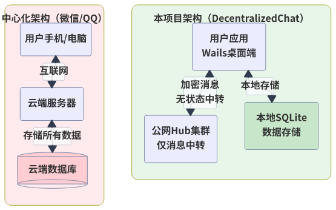

# 论文图表清单

本目录包含毕业论文所需的所有 Mermaid 图表源文件。

## 图表列表

| 序号 | 文件名 | 图表名称 | 对应章节 | 类型 |
|------|--------|---------|---------|------|
| 图1 | `fig1_arch_compare.mmd` | 中心化vs本项目架构对比 | 1.1 研究背景 | 架构图 |
| 图2 | `fig2_four_arch.mmd` | 四种架构模式对比 | 2.1 即时通信架构模式 | 架构图 |
| 图3 | `fig3_nats_routes.mmd` | NATS Routes全mesh架构 | 2.2 NATS消息系统 | 架构图 |
| 图4 | `fig5_nacl_box.mmd` | NaCl Box加密流程 | 2.3 端到端加密技术 | 流程图 |
| 图5 | `fig6_system_arch.mmd` | 系统总体架构图 | 3.3 系统架构设计 | 架构图 |
| 图6 | `fig7_message_sequence.mmd` | 消息流转时序图 | 3.3 系统架构设计 | 时序图 |
| 图7 | `fig8_network_arch.mmd` | 系统网络架构图 | 4.1.1 应用内置LeafNode | 架构图 |
| 图8 | `fig9_dm_crypto.mmd` | 私聊加密流程图 | 4.2.2 私聊加密实现 | 流程图 |
| 图9 | `fig10_db_er.mmd` | 数据库E-R图 | 4.3.1 数据库设计 | E-R图 |
| 图10 | `fig11_startup_flow.mmd` | 应用启动流程 | 4.4.1 应用启动流程 | 流程图 |
| 图11 | `fig12_key_system.mmd` | 双密钥体系 | 2.3.2 密钥体系 | 架构图 |
| 图12 | `fig13_crypto_compare.mmd` | 私聊与群聊加密对比 | 4.2.2 私聊加密实现 | 对比图 |
| 图13 | `fig14_module_deps.mmd` | 系统模块依赖图 | 3.3.3 模块划分 | 架构图 |
| 图14 | `fig15_data_flow.mmd` | 系统数据流图 | 3.3.2 数据流向设计 | 数据流图 |
| 图15 | `fig16_deployment.mmd` | Hub集群部署架构图 | 4.1.4 Hub集群配置 | 部署图 |
| 图16 | `fig17_user_state.mmd` | 用户状态转换图 | 4.4.1 应用启动流程 | 状态图 |
| 图17 | `fig18_security_arch.mmd` | 安全架构层次图 | 2.3.3 密钥安全性 | 架构图 |
| 图18 | `fig13_crypto_compare.mmd` | 私聊与群聊加密对比 | 4.2.2 私聊加密实现 | 对比图 |

## 导出命令

```bash
# 安装 mermaid-cli
npm install -g @mermaid-js/mermaid-cli

# 导出所有图表为 PNG
cd diagrams
for file in *.mmd; do
    mmdc -i "$file" -o "../images/${file%.mmd}.png" -b white
done

# 或导出为 SVG（推荐，矢量图更清晰）
for file in *.mmd; do
    mmdc -i "$file" -o "../images/${file%.mmd}.svg" -b white
done
```

## 在 Markdown 中引用

```markdown
如图1所示，本项目与传统中心化架构存在本质区别...



图1 中心化vs本项目架构对比
```

## 格式要求（海南大学标准）

- **图序及图题**：五号、宋体、居中
- **图题位置**：图片下方
- **图序格式**：不包含章节号（图1、图2...）
- **图片格式**：居中、黑色外框

## 颜色说明

图表中使用颜色仅为区分不同层次，最终导出应为黑白打印友好：
- 蓝色系 (#e3f2fd)：UI层/应用层
- 橙色系 (#fff3e0)：通信层/客户端层  
- 绿色系 (#e8f5e9)：数据层/本地存储
- 粉色系 (#fce4ec)：服务端/集群层
- 红色系 (#ffebee)：对比项（中心化）
