# 海南大学

## 毕业论文（设计）

**题目：** 基于NATS的去中心化即时通信系统设计与实现

---

| 项目 | 内容 |
|------|------|
| 学号 | （填写学号）|
| 姓名 | （填写姓名）|
| 年级 | 2022级 |
| 学院 | 计算机科学与技术学院 |
| 系别 | 软件工程系 |
| 专业 | 软件工程 |
| 指导教师 | （填写指导教师）|
| 完成日期 | 2026年4月 |

---

<div style="page-break-after: always;"></div>

# 摘 要

互联网技术的持续演进使得即时通信深度融入了人们的日常社交与生产活动。然而，当前占据市场主导地位的中心化即时通信工具（例如微信、QQ等）在数据隐私层面存在显著隐患——用户的聊天内容、社交关系等敏感信息悉数交由平台托管，由此带来了隐私泄露、数据滥用以及服务中断等多重风险。传统的去中心化通信路径如P2P模式虽能将数据保留在本地，却受制于NAT穿越障碍、离线消息难以投递等现实瓶颈。

本论文设计并实现了一套基于NATS的去中心化即时通信系统。系统采用C/S连接架构，但服务端仅转发消息，不存储用户数据；所有数据保存在本地SQLite数据库；通过NATS Routes构建多节点Hub集群实现服务端去中心化；采用Ed25519/X25519双密钥体系和NaCl Box端到端加密保障通信安全。

本文详细阐述了系统的需求分析、架构设计、网络通信、加密安全、本地存储和应用实现。测试结果表明，系统在保障安全与数据主权的同时，具备良好的易用性和可扩展性。

**关键词：** 去中心化；即时通信；NATS；端到端加密；数据主权

<div style="page-break-after: always;"></div>

# Abstract

This thesis designs and implements a decentralized instant messaging system based on NATS. The system adopts C/S connection architecture, but the server only relays messages without storing user data; all data is saved in local SQLite database; multi-node Hub cluster is built via NATS Routes for server-side decentralization; Ed25519/X25519 dual-key system and NaCl Box end-to-end encryption ensure communication security.

This paper elaborates on system requirements, architecture design, network communication, encryption security, local storage, and application implementation. Test results show that the system ensures security and data sovereignty while maintaining good usability and scalability.

**Keywords:** Decentralized; Instant Messaging; NATS; End-to-End Encryption; Data Sovereignty

<div style="page-break-after: always;"></div>

# 目 录

**第1章 绪论** .................................................................................................................. 1
&nbsp;&nbsp;&nbsp;&nbsp;1.1 研究背景与意义 ............................................................................................... 1
&nbsp;&nbsp;&nbsp;&nbsp;1.2 国内外研究现状 ............................................................................................... 2
&nbsp;&nbsp;&nbsp;&nbsp;1.3 研究内容与目标 ............................................................................................... 4
&nbsp;&nbsp;&nbsp;&nbsp;1.4 论文组织结构 ................................................................................................... 5

**第2章 相关技术综述** .................................................................................................. 6
&nbsp;&nbsp;&nbsp;&nbsp;2.1 即时通信架构模式 ........................................................................................... 6
&nbsp;&nbsp;&nbsp;&nbsp;2.2 NATS消息系统 ................................................................................................. 8
&nbsp;&nbsp;&nbsp;&nbsp;2.3 端到端加密技术 ............................................................................................. 11
&nbsp;&nbsp;&nbsp;&nbsp;2.4 跨平台桌面开发 ............................................................................................. 13

**第3章 系统需求分析与总体设计** ............................................................................ 14
&nbsp;&nbsp;&nbsp;&nbsp;3.1 功能需求 ......................................................................................................... 14
&nbsp;&nbsp;&nbsp;&nbsp;3.2 非功能需求 ..................................................................................................... 15
&nbsp;&nbsp;&nbsp;&nbsp;3.3 系统架构设计 ................................................................................................. 16

**第4章 系统详细设计与实现** .................................................................................... 19
&nbsp;&nbsp;&nbsp;&nbsp;4.1 网络通信模块 ................................................................................................. 19
&nbsp;&nbsp;&nbsp;&nbsp;&nbsp;&nbsp;&nbsp;&nbsp;4.1.1 应用内置的NATS LeafNode .................................................................. 19
&nbsp;&nbsp;&nbsp;&nbsp;&nbsp;&nbsp;&nbsp;&nbsp;4.1.2 NATS客户端与本地LeafNode连接 .................................................... 21
&nbsp;&nbsp;&nbsp;&nbsp;&nbsp;&nbsp;&nbsp;&nbsp;4.1.3 Hub认证机制 ........................................................................................ 22
&nbsp;&nbsp;&nbsp;&nbsp;&nbsp;&nbsp;&nbsp;&nbsp;4.1.4 Hub集群Routes配置 ........................................................................... 23
&nbsp;&nbsp;&nbsp;&nbsp;&nbsp;&nbsp;&nbsp;&nbsp;4.1.5 消息主题设计 ........................................................................................ 25
&nbsp;&nbsp;&nbsp;&nbsp;4.2 加密与安全模块 ............................................................................................. 25
&nbsp;&nbsp;&nbsp;&nbsp;&nbsp;&nbsp;&nbsp;&nbsp;4.2.1 密钥体系 ................................................................................................ 25
&nbsp;&nbsp;&nbsp;&nbsp;&nbsp;&nbsp;&nbsp;&nbsp;4.2.2 私聊加密实现 ........................................................................................ 27
&nbsp;&nbsp;&nbsp;&nbsp;&nbsp;&nbsp;&nbsp;&nbsp;4.2.3 群聊加密实现 ........................................................................................ 29
&nbsp;&nbsp;&nbsp;&nbsp;4.3 本地数据存储模块 ......................................................................................... 29
&nbsp;&nbsp;&nbsp;&nbsp;&nbsp;&nbsp;&nbsp;&nbsp;4.3.1 数据库设计 ............................................................................................ 29
&nbsp;&nbsp;&nbsp;&nbsp;&nbsp;&nbsp;&nbsp;&nbsp;4.3.2 消息搜索与历史查询 ............................................................................ 31
&nbsp;&nbsp;&nbsp;&nbsp;&nbsp;&nbsp;&nbsp;&nbsp;4.3.3 离线消息同步 ........................................................................................ 32
&nbsp;&nbsp;&nbsp;&nbsp;4.4 应用集成与前端 ............................................................................................. 33
&nbsp;&nbsp;&nbsp;&nbsp;&nbsp;&nbsp;&nbsp;&nbsp;4.4.1 应用启动流程 ........................................................................................ 33
&nbsp;&nbsp;&nbsp;&nbsp;&nbsp;&nbsp;&nbsp;&nbsp;4.4.2 前端界面设计 ........................................................................................ 34
&nbsp;&nbsp;&nbsp;&nbsp;&nbsp;&nbsp;&nbsp;&nbsp;4.4.3 核心功能实现 ........................................................................................ 35

**第5章 系统测试与验证** ............................................................................................ 36
&nbsp;&nbsp;&nbsp;&nbsp;5.1 测试环境 ......................................................................................................... 36
&nbsp;&nbsp;&nbsp;&nbsp;5.2 功能测试 ......................................................................................................... 37
&nbsp;&nbsp;&nbsp;&nbsp;5.3 安全性验证 ..................................................................................................... 39

**第6章 总结与展望** .................................................................................................... 41
&nbsp;&nbsp;&nbsp;&nbsp;6.1 工作总结 ......................................................................................................... 41
&nbsp;&nbsp;&nbsp;&nbsp;6.2 创新点 ............................................................................................................. 41
&nbsp;&nbsp;&nbsp;&nbsp;6.3 存在的不足 ..................................................................................................... 42
&nbsp;&nbsp;&nbsp;&nbsp;6.4 未来展望 ......................................................................................................... 42

**致 谢** .......................................................................................................................... 44

**参考文献** .................................................................................................................. 45

<div style="page-break-after: always;"></div>

# 第1章 绪论

## 1.1 研究背景与意义

微信、WhatsApp等主流应用采用中心化架构，存在**数据主权旁落**（平台掌控用户数据）、**隐私保护缺位**（元数据被记录）、**单点故障风险**（服务器故障影响所有用户）等问题。

现有去中心化方案各有不足：**纯P2P方案**（如Tox）面临NAT穿越和离线消息难题；**联邦式方案**（如Matrix）数据仍存储在服务器端。

本系统基于NATS实现去中心化即时通信：（1）服务端无状态，仅转发消息；（2）数据本地化存储；（3）Hub集群去中心化部署；（4）端到端加密。如图1所示，本系统数据完全保留在用户本地。


图1 中心化与本项目架构对比

## 1.2 国内外研究现状

### 1.2.1 中心化方案

微信、WhatsApp等采用中心化架构，数据存储在平台服务器。部分平台引入端到端加密（如WhatsApp使用Signal协议），但根本局限在于**数据仍存储在服务器上**，平台可获知通信元数据。

### 1.2.2 联邦式方案

联邦式架构（如XMPP、Matrix）由多个独立服务器组成网络，用户可选择信任的节点。相比中心化方案，用户可自主选择服务商，网络具备抗审查性。但未解决根本问题——**用户数据依旧存储在服务器上**。

### 1.2.3 纯P2P方案

纯P2P方案（如Tox、Session）彻底去除服务器，用户设备直接连接。优势是数据完全本地存储，抗审查能力强。但面临**NAT穿越困难**和**离线消息难以实现**的技术挑战。

### 1.2.4 各类方案对比

表1对各类通信方案进行了综合对比。

表1 各类通信方案对比

| 对比维度 | 中心化方案 | 联邦式方案 | P2P方案 | 本项目 |
|---------|-----------|-----------|---------|--------|
| 数据存储位置 | 云端服务器 | 所选服务器 | 本地 | 本地 |
| 服务端状态 | 有状态 | 有状态 | 无 | 无状态 |
| 去中心化程度 | 低 | 中 | 高 | 高 |
| NAT穿透需求 | 无 | 无 | 需要 | 无 |
| 离线消息支持 | 完善 | 依赖服务器 | 困难 | JetStream支持 |
| 连接复杂度 | 低 | 低 | 高 | 低 |
| 端到端加密 | 部分支持 | 部分支持 | 通常支持 | 完全支持 |


## 1.3 研究内容与目标

### 1.3.1 研究内容

（1）去中心化即时通信架构设计；（2）基于NATS的消息通信系统实现；（3）端到端加密与安全机制；（4）本地数据存储与管理；（5）跨平台桌面应用开发。

### 1.3.2 研究目标

设计并实现具备以下特性的系统：（1）服务端无业务逻辑，仅转发消息；（2）数据完全本地化；（3）端到端加密通信；（4）服务端去中心化部署；（5）支持离线消息。

### 1.3.3 创新点

（1）服务端零业务逻辑架构；（2）C/S架构下的数据主权；（3）Hub集群去中心化部署。

## 1.4 论文组织结构

本文共六章：第1章绪论；第2章相关技术综述；第3章系统需求分析与总体设计；第4章系统详细设计与实现；第5章系统测试与验证；第6章总结与展望。

<div style="page-break-after: always;"></div>

# 第2章 相关技术综述

## 2.1 即时通信架构模式

即时通信系统架构可分为中心化C/S、联邦式和纯P2P三类，在数据存储位置、连接复杂度、去中心化程度上各有特点。

### 2.1.1 中心化C/S架构

中心化C/S架构中，客户端负责界面和本地逻辑，服务端承担业务逻辑、数据持久化和消息转发。

工作流程：用户登录时服务端验证身份并创建会话；发送消息时服务端查找接收方连接并转发；离线消息由服务端暂存。

优势：技术成熟、连接简单、功能丰富、安全可控。但根本问题是数据主权——用户数据集中存储在服务器，必须完全信赖服务提供商。

### 2.1.2 联邦式架构

联邦式架构由多个独立服务器（节点）组成网络，用户可选择信任的节点注册，节点间通过标准协议互联。

工作流程：用户注册后获得节点域内唯一标识（如user@node.com）；同节点通信流程类似中心化；跨节点通信需经双方节点转发。

XMPP和Matrix是代表性协议。联邦式架构的进步在于用户可选择服务商，网络具备抗审查性和容错性。但未解决根本问题——**用户数据仍存储在服务器上**。

### 2.1.3 纯P2P架构

纯P2P架构完全去除服务器，用户设备直接建立连接。用户上线时通过DHT广播网络地址，发送消息时通过DHT查找接收方地址并建立连接。

P2P架构的优势是数据主权（所有数据存储在本地）和抗审查能力（无法通过封锁服务器阻止通信）。

但P2P面临技术挑战：**NAT穿透困难**（大多数设备位于NAT后，无公网IP）；**离线消息难以实现**（接收方不在线时无法传输消息）；**网络拓扑复杂**（消息路由路径不确定，延迟和可靠性难保证）。

### 2.1.4 本项目架构设计

本项目采用一种独特的架构设计：在保持C/S架构连接简单性的同时，通过服务端无状态设计和数据本地化实现去中心化的核心优势。

如图2所示，本系统的架构可以概括为"C/S连接，P2P数据"——连接层面采用客户端-服务器模式，简化了网络连接；数据层面采用完全本地存储，实现了数据主权。

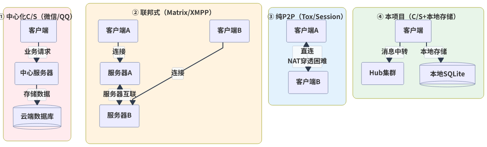

图2 四种架构模式对比

具体来说，本系统的架构特点包括：

（1）**服务端无状态**：服务端仅作为消息传输层，不存储任何用户会话状态，不处理任何业务逻辑。每个消息都是独立的，服务端只负责根据主题将消息转发给订阅者。

（2）**数据完全本地**：所有聊天记录、联系人信息、群组数据均存储在用户本地的SQLite数据库中。服务端只中转加密后的消息，不存储消息内容。

（3）**端到端加密**：所有消息采用端到端加密，只有通信双方能够解密。服务端即使被攻破，也只能获取密文，无法获取明文内容。

（4）**服务端去中心化**：通过NATS Routes技术构建多节点Hub集群，集群内节点地位平等，实现了服务端的去中心化部署。

这种架构设计的核心思想是：将"连接"和"数据"分离。连接采用C/S架构保证了技术简单性和可靠性；数据采用完全本地存储保证了用户的数据主权。相比于P2P架构，本方案避免了NAT穿透的技术难题；相比于传统C/S架构，本方案实现了数据主权归属于用户。

## 2.2 NATS消息系统

NATS是开源高性能消息系统，采用发布/订阅模式，广泛应用于微服务通信、物联网等场景。本节介绍NATS核心技术及其在本系统中的应用。

### 2.2.1 JetStream消息系统

JetStream是NATS内置的持久化消息流系统，为NATS提供消息持久化、流处理、消费者组等高级功能。本系统的所有消息传输均基于JetStream实现，确保消息可靠传输和离线消息支持。

**JetStream核心概念**：

（1）**Stream（流）**：消息持久化的容器。本系统配置两个Stream：DChatDirect存储私聊消息（主题`dchat.dm.*.msg`），DChatGroups存储群聊消息（主题`dchat.grp.*.msg`）。

（2）**Consumer（消费者）**：从Stream中消费消息的实体。本系统使用Pull Consumer模式，客户端主动拉取消息，便于控制消费速率。

（3）**消息确认（ACK）**：消费者处理完消息后发送ACK确认，服务器才将消息标记为已消费。未确认的消息会被重新投递。

**本系统的消息传输流程**：

（1）**消息发布**：应用通过JetStream API（`js.Publish`）发布消息，消息被持久化到对应的Stream中，同时推送给当前在线的订阅者。

（2）**在线接收**：客户端订阅感兴趣的主题，实时接收新消息。

（3）**离线同步**：用户上线后，通过Pull Consumer从Stream拉取离线期间的消息，处理完成后发送ACK确认。

JetStream的持久化能力确保了即使接收方不在线，消息也不会丢失，实现了本系统对离线消息的需求。

### 2.2.2 NATS Routes与集群架构

NATS Routes是NATS实现多节点集群的核心机制。通过Routes，多个NATS服务器可以互联形成一个集群，集群内的消息自动广播到所有节点。

Routes集群采用全mesh（全网状）拓扑结构：集群内的每个节点都与其他所有节点建立直接的TCP连接。当消息发布到某个节点时，该节点会将消息转发给集群内的所有其他节点，再由各节点转发给本地订阅者。这种全mesh设计确保了消息的快速传播，但也限制了集群规模——随着节点数增加，节点间连接数呈平方增长。

Routes集群的配置非常简单，只需要在配置文件中指定其他节点的地址即可：

```
cluster {
  name: "hub"
  listen: "0.0.0.0:6222"
  routes: [
    "nats-route://node1.example.com:6222"
    "nats-route://node2.example.com:6222"
  ]
}
```

Routes集群具有以下特点：

（1）**自动发现**：新节点启动后会自动与配置中的节点建立连接，并从这些节点获取集群内其他节点的信息，自动建立完整的全mesh连接。

（2）**消息广播**：发布到集群中任意节点的消息，会自动传播到集群内的所有其他节点。

（3）**无单点故障**：集群内节点地位平等，没有主节点。任一节点故障只会影响连接到该节点的客户端，不会影响整个集群的服务。

（4）**水平扩展**：可以通过增加节点来扩展集群的处理能力，但需要预先配置好所有节点的连接信息。

如图3所示，本系统的Hub集群采用Routes全mesh架构，多个Hub节点地位平等，形成了去中心化的服务端架构。

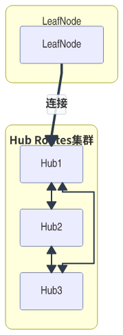

图3 NATS Routes全mesh架构

### 2.2.3 LeafNode与层级扩展

LeafNode是NATS提供的层级扩展机制，允许将本地NATS服务器作为叶子节点连接到远程Hub集群。这种设计非常适合边缘计算场景，可以在本地部署轻量级NATS服务器，再通过LeafNode连接到中心集群。

LeafNode的工作原理如下：本地NATS服务器（LeafNode）启动后，通过LeafNode协议连接到远程Hub；本地客户端连接到LeafNode，像连接普通NATS服务器一样发布和订阅消息；LeafNode自动将本地消息转发到Hub，将Hub的消息转发到本地客户端。对于本地客户端来说，连接到LeafNode与直接连接到Hub的体验完全一致。

LeafNode的特点包括：

（1）**协议兼容**：LeafNode对本地客户端完全透明，客户端不需要感知LeafNode的存在，使用标准的NATS客户端库即可。

（2）**灵活部署**：LeafNode可以部署在用户本地、边缘设备或内网环境中，通过单一连接与Hub通信，简化了网络配置。

（3）**安全隔离**：LeafNode可以配置本地账户体系，限制本地客户端的权限，实现安全隔离。

（4）**自动重连**：LeafNode与Hub的连接断开后会自动重连，保证连接的可靠性。

在本系统中，每个用户的应用内置了一个LeafNode，本地监听127.0.0.1:4222。应用内的NATS客户端连接到本地LeafNode，LeafNode再连接到公网Hub集群。这种设计的好处是：应用内的客户端与LeafNode之间的通信完全在本地，无需认证（因为都在应用内部）；LeafNode到Hub的连接可以根据需要配置认证，保证安全性。

## 2.3 端到端加密技术

端到端加密（End-to-End Encryption，E2EE）是指消息在发送方设备上加密，在接收方设备上解密，中间传输过程中始终保持密文状态的加密方式。即使消息经过的服务器被攻破，攻击者也只能获取密文，无法获取明文内容。本节将介绍本系统采用的端到端加密技术。

### 2.3.1 NaCl Box加密方案

NaCl（Networking and Cryptography library）是一个开源的密码学库，由密码学专家Daniel J. Bernstein设计。NaCl的设计理念是提供简单、安全、高性能的密码学原语，避免开发者因误用密码学API而导致安全问题。

NaCl Box是NaCl提供的一种高级加密方案，结合了X25519密钥交换和XSalsa20-Poly1305对称加密。Box加密方案的工作流程如下：

（1）**密钥交换**：发送方生成临时的X25519密钥对，使用自己的私钥和接收方的公钥通过ECDH（椭圆曲线Diffie-Hellman）算法计算出共享密钥。

（2）**对称加密**：使用共享密钥和随机生成的Nonce（一次性数字），通过XSalsa20流密码对明文进行加密，然后使用Poly1305消息认证码（MAC）对密文进行认证，生成认证标签。

（3）**消息组装**：将临时公钥、Nonce、密文和认证标签组装成最终的消息格式发送给接收方。

（4）**解密验证**：接收方收到消息后，使用自己的私钥和发送方的临时公钥计算出相同的共享密钥，使用共享密钥和Nonce解密并验证MAC，获取明文。

NaCl Box的设计具有以下安全特性：

（1）**前向安全性**：由于每次加密都生成临时密钥对，即使长期私钥泄露，也无法解密之前的历史消息。

（2）**认证加密**：XSalsa20-Poly1305同时提供保密性和完整性保护，攻击者无法篡改密文而不被检测。

（3）**常量时间算法**：所有加密操作都使用常量时间算法，避免时序侧信道攻击。

如图4所示，NaCl Box加密流程涉及发送方和接收方的密钥交换与加解密过程。

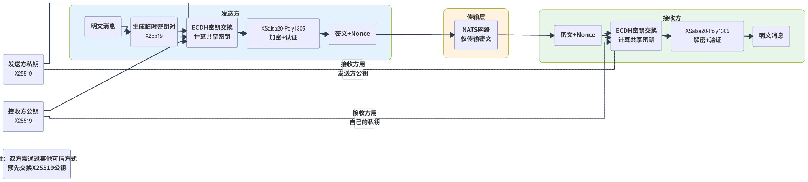

图4 NaCl Box加密流程

### 2.3.2 Ed25519与X25519密钥体系

本系统采用双密钥体系：Ed25519用于身份签名和认证，X25519用于加密密钥交换。这种分离设计的核心原因是签名密钥和加密密钥的使用场景不同，分离可以提高安全性。

Ed25519是一种基于Curve25519曲线的数字签名算法，具有以下特点：

（1）**安全性高**：Ed25519被认为是对椭圆曲线离散对数问题（ECDLP）具有128位安全强度的算法，目前没有已知的有效攻击方法。

（2）**速度快**：Ed25519的签名和验签速度都很快，适合高并发场景。

（3）**签名确定性**：Ed25519使用确定性Nonce生成，避免了随机数生成器问题导致的私钥泄露风险。

（4）**密钥紧凑**：Ed25519公钥仅32字节，签名仅64字节，传输开销小。

X25519是基于Curve25519曲线的密钥交换算法，用于ECDH密钥协商。Curve25519与Ed25519基于相同的底层曲线，但参数设置不同，分别优化用于密钥交换和数字签名。

本系统中，Ed25519密钥对用于NATS的JWT认证。用户创建身份时生成Ed25519密钥对，NATS使用这个密钥对签发JWT令牌，Hub验证JWT来确认用户身份。这种身份认证机制保证了只有合法用户才能连接到Hub。

### 2.3.3 密钥派生与安全性

本项目采用Ed25519作为身份签名密钥，但**不直接使用其进行消息加密**。原因如下：首先，Ed25519是专为数字签名设计的曲线，不具备直接加密能力；其次，根据密码学最佳实践，签名密钥与加密密钥应分离，避免单点失效导致既丢失身份认证又泄露通信内容；最后，通过Ed25519私钥派生X25519密钥对（基于曲线同源特性），既保持身份一致性，又获得ECDH密钥交换能力，实现端到端加密。

密钥派生的过程基于Ed25519和X25519曲线的同源关系。由于两种算法基于相同的底层数学结构，可以从Ed25519私钥确定性地派生出对应的X25519私钥。这种派生是单向的，无法从X25519私钥反推出Ed25519私钥。这样设计的优势是：用户只需要保存一个种子（seed），既可以用于身份认证，又可以用于消息加密；同时两种用途的密钥是分离的，即使加密密钥泄露，也不会影响身份认证的安全性。

私钥本地存储方面，用户的私钥（包括Ed25519种子和派生的X25519私钥）仅存储在用户本地设备的~/.dchat/目录下，以文件形式保存。服务端不保存任何用户的私钥信息，甚至不知道用户的公钥（除非用户主动分享给其他用户）。这种设计确保了密钥的绝对安全性，即使服务端被攻破，攻击者也无法获取任何用户的私钥。

## 2.4 跨平台桌面开发

### 2.4.1 Wails框架介绍

Wails是构建跨平台桌面应用的开源框架，Go编写后端，Web技术构建前端。

核心架构：（1）**Go后端**：编译为原生机器码，执行效率高；（2）**Web前端**：使用React等框架，运行在嵌入WebView中；（3）**绑定机制**：Go方法与前端JavaScript自动绑定；（4）**事件系统**：支持前后端事件通信。

### 2.4.2 Wails与Electron对比

Electron是流行的跨平台框架，但存在**体积庞大**（需打包Chromium和Node.js，超100MB）、**资源占用高**（独立Chromium进程）、**启动慢**等问题。

Wails优势：**体积小**（使用系统原生WebView）、**资源占用低**、**启动快**、**性能高**（Go后端）。本系统选择Wails以提供流畅体验。

<div style="page-break-after: always;"></div>

# 第3章 系统需求分析与总体设计

## 3.1 功能需求

本系统旨在设计并实现一个去中心化的即时通信系统，满足用户对隐私保护和数据主权的需求。通过详细的需求分析，确定系统需要实现以下核心功能：

### 3.1.1 用户身份管理

用户身份管理是系统的基础功能，包括用户注册、身份创建、密钥管理等。具体需求如下：

（1）**身份创建**：用户首次使用系统时，需要创建数字身份。系统自动生成Ed25519签名密钥对和派生的X25519加密密钥对，作为用户的身份标识。

（2）**密钥本地存储**：用户的私钥（种子文件）仅存储在本地~/.dchat/目录下，采用文件系统权限保护，确保只有当前用户可以访问。

（3）**公钥分享**：用户可以导出自己的公钥信息，通过安全渠道分享给其他用户，作为建立加密通信的基础。

（4）**身份导入/导出**：用户可以将身份数据导出为备份文件，在新设备上导入恢复身份和聊天记录。

### 3.1.2 即时通信功能

即时通信是系统的核心功能，支持私聊和群聊两种模式：

（1）**私聊功能**：用户可以通过对方的公钥或用户ID发起私聊。私聊消息采用端到端加密，只有通信双方能够解密。

（2）**群聊功能**：用户可以创建群组，邀请其他用户加入。群聊消息采用对称密钥加密，群组成员共享群密钥。

（3）**消息类型**：支持文本消息，未来可扩展支持图片、文件等多媒体消息。

（4）**消息状态**：显示消息的发送状态（发送中、已发送、已送达）。

### 3.1.3 离线消息功能

离线消息功能保证用户在不在线时也能接收消息：

（1）**消息暂存**：当接收方不在线时，消息被暂存在Hub的JetStream中，等待接收方上线后拉取。

（2）**自动同步**：用户上线后，系统自动拉取离线期间的消息，按时间顺序展示在会话中。

（3）**消息去重**：通过消息ID进行去重，避免重复消息。

（4）**ACK确认**：接收方处理完消息后发送ACK确认，Hub收到ACK后删除暂存的消息。

### 3.1.4 本地历史记录

本地历史记录功能提供消息的持久化存储和查询：

（1）**自动保存**：所有发送和接收的消息自动保存到本地SQLite数据库。

（2）**历史查询**：用户可以按会话查看历史消息，支持分页加载。

（3）**消息搜索**：支持按关键词搜索消息内容，快速定位历史消息。

（4）**数据管理**：用户可以导出聊天记录，或在需要时清空本地数据。

## 3.2 非功能需求

除了功能需求，系统还需要满足以下非功能需求，保证系统的可用性、安全性和可扩展性。

### 3.2.1 安全性需求

安全性是本系统的核心关注点，需要满足以下需求：

（1）**端到端加密**：所有私聊消息必须采用端到端加密，只有通信双方能够解密。服务端即使被攻破，也无法获取明文内容。

（2）**密钥本地存储**：用户的私钥必须仅存储在本地设备上，不得传输到服务端或任何第三方。

（3）**前向安全性**：即使长期私钥泄露，也无法解密之前的历史消息。

（4）**认证安全**：身份认证采用Ed25519数字签名，防止身份伪造。

### 3.2.2 数据主权需求

数据主权是本系统的核心设计理念，需要满足以下需求：

（1）**数据本地化**：所有用户数据（聊天记录、联系人、群组信息）必须存储在用户本地，不得上传到服务端。

（2）**用户控制**：用户对自己的数据拥有完全控制权，可以导出、备份或删除数据。

（3）**服务端无状态**：服务端不得存储任何用户会话状态或业务数据，仅作为消息中转节点。

### 3.2.3 可用性需求

系统需要具备良好的可用性，满足以下需求：

（1）**跨平台支持**：系统需要支持主流桌面操作系统，包括Windows，Linux和MacOS。

（2）**离线可用**：用户在无网络连接时可以查看本地历史记录，网络恢复后自动同步新消息。

（3）**故障切换**：当某个Hub节点故障时，系统可以自动切换到其他可用节点。

（4）**响应速度**：消息发送和接收的延迟应控制在合理范围内（通常小于1秒）。

### 3.2.4 可扩展性需求

系统需要具备良好的可扩展性，满足以下需求：

（1）**水平扩展**：Hub集群可以通过增加节点来扩展处理能力。

（2）**主题扩展**：消息主题设计应支持未来功能扩展，如新增消息类型、新功能模块等。

（3）**协议兼容**：系统设计应考虑与潜在的其他系统互联互通的可能性。

## 3.3 系统架构设计

### 3.3.1 总体架构

本系统采用分层架构设计，从上到下依次为应用层、NATS客户端层、LeafNode层和集群层。如图5所示，各层之间职责清晰，通过标准协议进行通信。

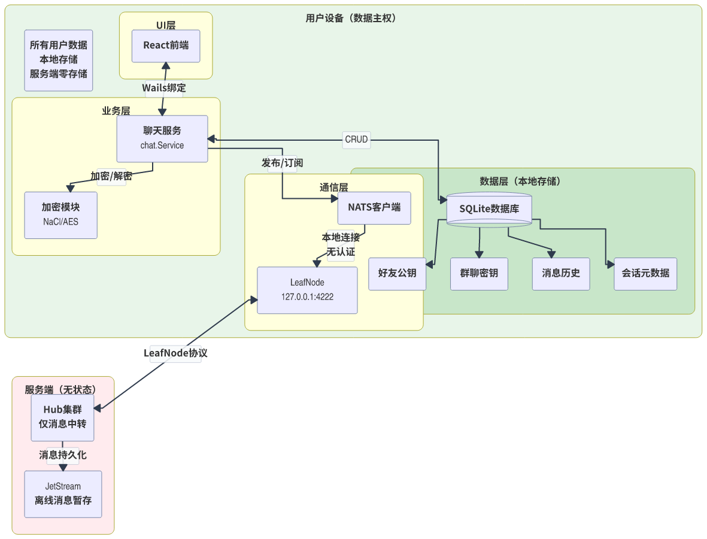

图5 系统总体架构图

各层的功能描述如下：

**应用层**：基于Wails框架构建的桌面应用，包含React前端和Go后端。前端负责用户界面展示，后端负责业务逻辑处理，包括加密解密、数据库操作、NATS客户端管理等。

**NATS客户端层**：应用内嵌的NATS客户端，连接到本地LeafNode（127.0.0.1:4222）。客户端负责发布消息到主题和订阅感兴趣的主题，处理收发消息的逻辑。

**LeafNode层**：应用内置的NATS Server作为LeafNode，本地监听127.0.0.1:4222，仅接受本机连接。LeafNode作为本地接入点，将应用内的NATS客户端连接到远程Hub集群。

**集群层**：公网部署的NATS Hub集群，通过Routes形成全mesh网络。集群负责消息的跨节点转发，实现多节点去中心化部署。

**认证层**：基于NSC（NATS Security Center）的JWT认证体系。Hub配置账户解析器，验证客户端的JWT凭证后才允许连接。

### 3.3.2 数据流向设计

如图15所示，系统的数据流向遵循"本地加密→传输→远程解密"的原则。

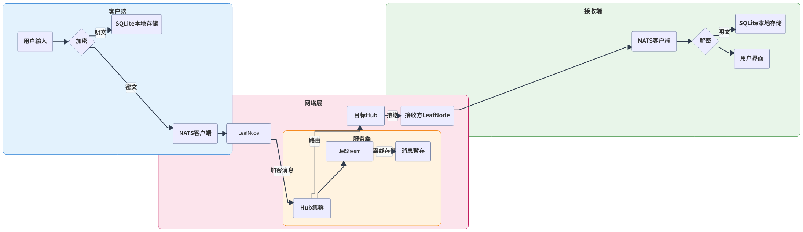

图15 系统数据流向

具体流程如下：

**发送消息流程**：

（1）用户在应用界面输入消息内容，点击发送。

（2）应用后端根据接收方公钥，使用NaCl Box加密消息内容。

（3）构造EncWire消息结构，包含会话ID（cid）、发送者ID（sender）、时间戳（ts）、Nonce、密文（cipher）和昵称（nickname）。

（4）将EncWire序列化为JSON，通过NATS客户端发布到对应主题（dchat.dm.<cid>.msg）。

（5）本地LeafNode接收到消息，转发到连接的Hub。

（6）Hub根据主题将消息转发给集群内其他节点和本地订阅者。

**接收消息流程**：

（1）Hub接收到消息后，根据主题查找订阅者。

（2）如果接收方在线，消息通过Routes广播到接收方连接的Hub，再转发到接收方的LeafNode。

（3）接收方应用内的NATS客户端接收到消息，调用回调函数处理。

（4）应用后端解析EncWire结构，使用私钥和发送方公钥解密cipher字段。

（5）将解密后的明文消息保存到本地SQLite数据库，并通过Wails事件通知前端展示。

（6）发送ACK确认给Hub，如果是离线消息则删除JetStream中的暂存消息。

如图6所示，消息流转涉发送方应用、本地LeafNode、Hub集群、接收方LeafNode和接收方应用多个组件。

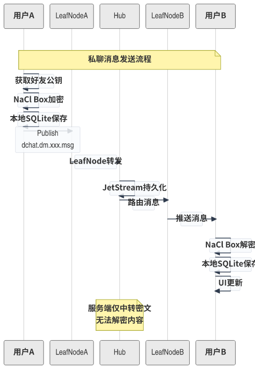

图6 消息流转时序图

### 3.3.3 模块划分

如图14所示，系统采用分层架构，各模块职责清晰。

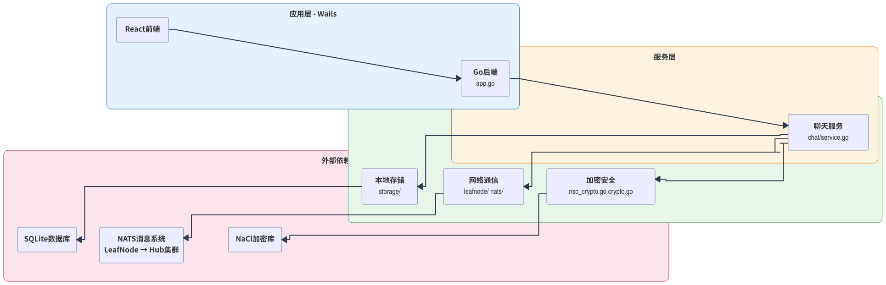

图14 系统模块依赖关系

根据功能需求，系统划分为以下模块：

**网络通信模块**：负责NATS连接管理、消息发布订阅、LeafNode管理、Hub集群连接等功能。主要代码位于internal/leafnode/和internal/nats/目录。

**加密安全模块**：负责密钥生成与管理、消息加密解密、数字签名与验证等功能。主要代码位于internal/chat/nsc_crypto.go和internal/chat/crypto.go。

**本地存储模块**：负责SQLite数据库操作、消息CRUD、历史查询、搜索功能等。主要代码位于internal/storage/目录。

**聊天服务模块**：负责业务逻辑处理，包括会话管理、消息处理、群组管理、离线同步等。主要代码位于internal/chat/service.go。

**应用集成模块**：负责Wails应用生命周期管理、前后端绑定、事件通知等。主要代码位于app.go。

<div style="page-break-after: always;"></div>

# 第4章 系统详细设计与实现

## 4.1 网络通信模块

网络通信模块是系统的基础设施，负责建立和维护网络连接，实现消息的可靠传输。本节将详细介绍应用内置NATS LeafNode的设计、NATS客户端连接、Hub认证机制、Routes集群配置以及消息主题设计。

### 4.1.1 应用内置的NATS LeafNode

本系统的核心设计之一是应用内置NATS Server作为LeafNode。这种设计带来了多重优势：本地客户端与LeafNode的通信无需网络传输和认证，简化了架构；LeafNode作为本地代理，统一处理与远程Hub的连接管理；应用完全控制LeafNode的生命周期，可以根据需要动态配置。

LeafNode管理器的核心功能包括Hub地址解析、Server配置构建和Server生命周期管理。Hub地址解析支持配置多个Hub URL，格式为nats://host:port，解析后转换为LeafNode远程配置。Server配置构建时，LeafNode监听本地127.0.0.1:4222，仅接受本机连接，同时配置远程Hub连接，支持JWT认证凭证。

LeafNode的核心启动流程如下：首先解析配置中指定的Hub URLs，然后构建包含远程连接信息的Server选项，接着创建并启动NATS Server实例，最后将Server实例保存到管理器中以便后续管理。关键代码实现包括Hub地址解析、Server选项构建和Server启动。

如图7所示，系统网络架构清晰地展示了从用户应用到Hub集群的完整连接路径。

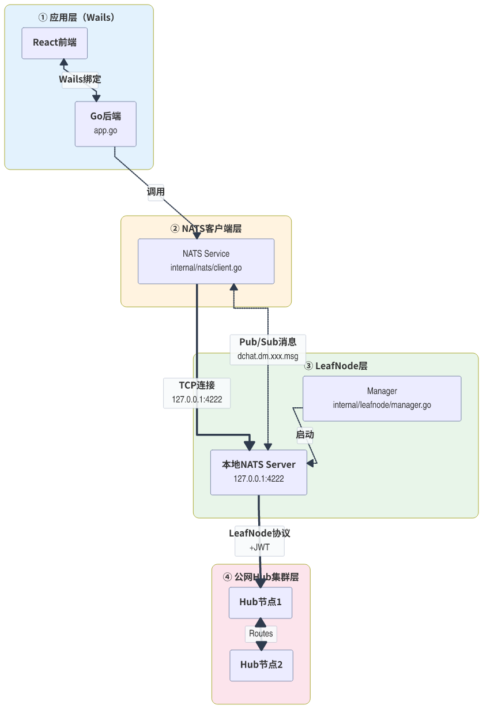

图7 系统网络架构图

如图16所示，实际部署场景中，多个用户通过LeafNode连接到Hub集群，各Hub节点通过Routes全mesh互联。

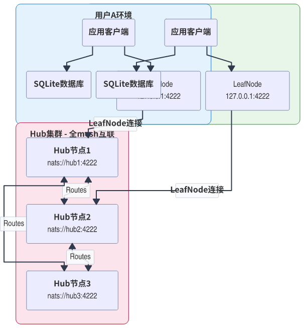

图16 系统部署架构

### 4.1.2 NATS客户端与本地LeafNode连接

应用内的NATS客户端连接到本地LeafNode（127.0.0.1:4222），这种本地连接具有特殊性：由于完全在应用内部，本地连接无需任何认证。这种设计简化了认证流程，避免了不必要的凭证管理。

NATS客户端的核心功能包括连接管理、主题订阅和消息发布。连接管理负责建立和维护与本地LeafNode的TCP连接，支持自动重连。主题订阅负责订阅感兴趣的消息主题，注册消息处理回调。消息发布负责将加密后的消息发布到指定主题。

客户端连接到本地LeafNode后，发送和接收消息的流程如下：发送消息时，客户端将序列化后的EncWire消息发布到主题（如dchat.dm.<cid>.msg）；本地LeafNode接收到消息后，自动转发到远程Hub；Hub根据主题将消息路由到订阅者；接收消息时，Hub将消息推送到接收方的LeafNode，LeafNode再推送到本地客户端；客户端调用注册的回调函数处理消息。

### 4.1.3 Hub认证机制

Hub支持两种认证模式：默认无鉴权模式和JWT认证模式，以适应不同的部署场景。

**默认无鉴权模式**：Hub默认不启用认证，任何LeafNode都可以连接。这种模式便于快速测试和公网共享部署，降低了使用门槛。在这种模式下，虽然Hub不对连接进行身份验证，但消息的端到端加密仍然保证了通信安全。

**JWT认证模式**：对于私有部署场景，可以启用基于NSC（NATS Security Center）的JWT认证体系。NSC是NATS提供的安全中心工具，用于管理Operator、Account和User三级密钥体系。使用NSC创建Operator（根证书）、Account（账户）和User（用户），为User生成JWT凭证文件（user.creds）。Hub配置simple_resolver.conf加载账户信息，验证连接的JWT。LeafNode配置creds文件路径，连接时自动携带凭证。

安全建议方面，Operator私钥（operator.nk）是最高权限密钥，必须离线保存，仅用于签发Account。部署时，仅将公开的resolver配置和accounts目录复制到服务器，私钥文件保留在本地。

### 4.1.4 Hub集群Routes配置

Hub集群通过Routes形成全mesh网络，实现服务端的去中心化部署。

**Routes全mesh架构**：集群内每个Hub节点都与其他所有节点建立直接的TCP连接。当消息发布到某个节点时，该节点将消息转发给集群内所有其他节点，再由各节点转发给本地连接的客户端。这种设计确保了消息的快速传播，但也限制了集群规模——随着节点数n增加，节点间连接数为n*(n-1)/2。

**集群边界与限制**：当前实现采用固定集群配置。这源于技术取舍：若不支持离线消息（不用JetStream），纯NATS的Routes集群支持动态新增节点，新节点可链式连接到一个节点后自动发现集群内其他节点；若支持离线消息（使用JetStream），集群节点必须固定，新节点无法动态加入，这是由JetStream使用的Raft共识算法限制的。此外，无论哪种方式，本系统都无法突破NAT穿透实现真正的P2P通信。

**去中心化体现**：尽管存在集群边界限制，Routes集群仍然实现了服务端的去中心化：集群内多个Hub地位平等，无主节点，任一Hub故障不影响集群整体服务，集群可水平扩展（需预先配置），不同集群之间可通过Gateway互联。

### 4.1.5 消息主题设计

消息主题（Subject）是NATS中消息路由的基础，本系统采用层次化的主题设计。

**私聊主题**：私聊消息的主题格式为`dchat.dm.<cid>.msg`，其中cid（Conversation ID）是会话唯一标识，由通信双方用户ID排序后拼接哈希生成。这种设计确保两个用户之间的会话具有固定的主题，双方都知道该主题，但不暴露给其他用户。

**群聊主题**：群聊消息的主题格式为`dchat.grp.<gid>.msg`，其中gid是群组ID，由创建时随机生成。所有群组成员订阅该主题，即可接收群消息。

**系统主题**：预留`dchat.sys.*`主题用于系统消息，如好友请求、群组邀请等。

Conversation ID的生成算法保证了确定性：将通信双方的用户ID按字典序排序，用":"连接后计算SHA-256哈希，取前16字节编码为十六进制字符串。这样，无论哪一方发起会话，生成的cid都相同，确保双方订阅相同的主题。

## 4.2 加密与安全模块

如图18所示，系统安全架构分为四层：应用层、安全层、传输层和服务端，各层协同保障通信安全。

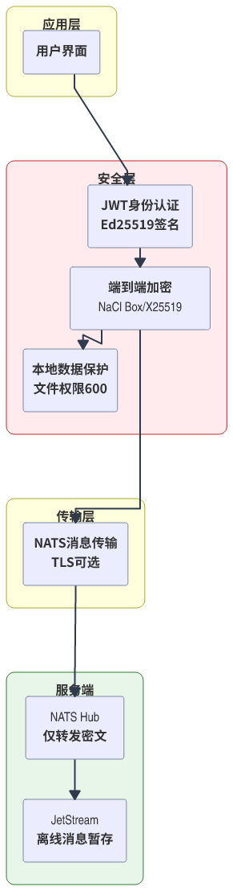

图18 安全架构分层

加密与安全模块是保障系统通信安全的核心，负责密钥管理、消息加密解密等。本节将详细介绍密钥体系设计、私聊加密实现和群聊加密实现。

### 4.2.1 密钥体系

本系统采用双密钥体系：Ed25519用于身份签名和认证，X25519用于加密密钥交换。这种分离设计的核心原因是签名密钥和加密密钥的使用场景不同，分离可以提高安全性。

**Ed25519签名密钥**：Ed25519是基于Curve25519曲线的数字签名算法，具有安全性高、速度快、签名确定性的特点。在本系统中，Ed25519密钥对用于NATS的JWT认证。用户创建身份时生成Ed25519密钥对，NATS使用这个密钥对签发JWT令牌，Hub验证JWT来确认用户身份。

**X25519加密密钥**：X25519是基于Curve25519曲线的密钥交换算法，用于ECDH密钥协商。在本系统中，X25519密钥对从Ed25519私钥派生而来，用于NaCl Box加密时的密钥交换。这种派生基于Curve25519与Ed25519曲线的同源特性，是确定性的但不可逆的。

**密钥派生原理**：本项目采用Ed25519作为身份签名密钥（用于NATS JWT认证），但不直接使用其进行消息加密。原因如下：首先，Ed25519是专为数字签名设计的曲线，不具备直接加密能力；其次，根据密码学最佳实践，签名密钥与加密密钥应分离，避免单点失效导致既丢失身份认证又泄露通信内容；最后，通过Ed25519私钥派生X25519密钥对（基于曲线同源特性），既保持身份一致性，又获得ECDH密钥交换能力，实现端到端加密。这种设计确保即使签名密钥意外泄露，历史会话的加密消息仍无法被解密。

如图12所示，本系统采用双密钥体系，从随机种子派生Ed25519签名密钥和X25519加密密钥，实现签名与加密分离。

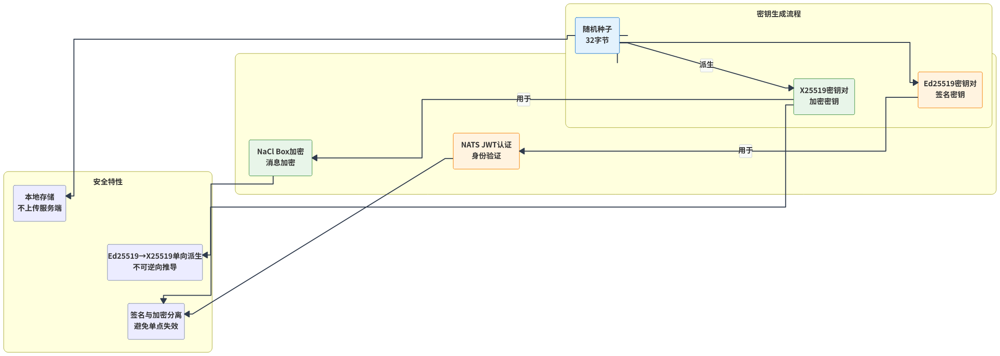

图12 密钥体系设计

**本地存储**：用户的私钥以文件形式存储在~/.dchat/目录下：operator.nk是Operator私钥（创建时生成，应离线保存），account.nk是Account私钥，user.seed是User种子（从中可派生所有密钥），user.creds是JWT凭证文件。这些文件采用文件系统权限保护，确保只有当前用户可以访问。

### 4.2.2 私聊加密实现

如图13所示，私聊采用NaCl Box端到端加密，群聊采用AES-256-GCM对称加密，两种方案各有特点。

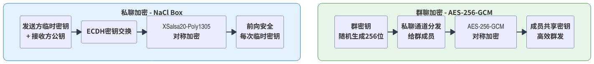

图13 加密方案对比

私聊采用NaCl Box端到端加密，确保只有通信双方能够解密消息。

**加密流程**：

（1）生成临时密钥对：发送方生成临时的X25519密钥对（ephemeralPriv, ephemeralPub）。

（2）计算共享密钥：使用临时私钥和对方公钥通过ECDH计算共享密钥sharedKey。

（3）加密消息：使用sharedKey和随机生成的Nonce，通过XSalsa20-Poly1305加密明文，生成密文和认证标签。

（4）构造消息：将临时公钥、Nonce、密文组装成EncWire结构。

**消息字段设计**：

表2展示了EncWire消息的最小载荷设计。

表2 EncWire消息字段

| 字段 | 类型 | 说明 |
|------|------|------|
| cid | string | 会话ID，用于路由到正确会话 |
| sender | string | 发送者ID，明文标识发送者 |
| ts | int64 | 时间戳（秒级），用于消息排序 |
| nonce | string | NaCl Box随机数（Base64编码） |
| cipher | string | 密文（Base64编码），实际加密内容 |
| nickname | string | 发送者昵称（可选），用于展示 |

设计原则：最小化暴露信息，cid、sender、nickname为明文（用于路由和展示），业务内容加密。需要澄清的是，虽然cipher字段包含加密后的业务内容，但EncWire结构本身以明文JSON形式传输。nonce是base64编码的随机字节，不是加密数据，用于接收方正确解密cipher。

**解密流程**：

（1）接收方收到EncWire消息后，提取sender字段识别发送者。

（2）从好友列表中获取发送者的公钥。

（3）使用自己的私钥和发送方的公钥，结合消息中的Nonce，通过NaCl Box解密cipher字段。

（4）验证MAC确保消息未被篡改。

（5）将解密后的明文保存到本地数据库。

如图8所示，私聊加密流程清晰地展示了从密钥交换到消息加解密的完整过程。

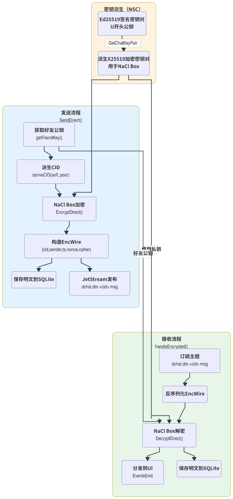

图8 私聊加密流程图

### 4.2.3 群聊加密实现

群聊采用对称加密方案，所有群组成员共享同一个群密钥。

**群密钥生成**：创建群组时，系统随机生成256位（32字节）的AES-256-GCM密钥作为群密钥。

**密钥分发**：群密钥通过私聊通道分发给群组成员。当新成员加入时，管理员使用与新成员的私聊通道将群密钥发送给新成员。这种设计确保只有群组成员能够获得群密钥。

**群消息加密**：发送群消息时，使用群密钥和随机Nonce通过AES-256-GCM加密消息内容。构造的EncWire结构与私聊类似，但cipher字段使用群密钥加密。

**群消息解密**：接收群消息时，使用群密钥和消息中的Nonce解密cipher字段。由于所有成员共享同一密钥，任何成员都可以解密群消息。

**安全性考虑**：群聊加密的安全性依赖于群密钥的保密性。如果群密钥泄露，所有群消息都可能被解密。因此，系统需要谨慎管理群密钥，在成员退出时考虑轮换密钥（当前版本暂未实现）。

## 4.3 本地数据存储模块

本地数据存储模块负责所有用户数据的持久化存储，是系统实现数据主权的核心。本节将详细介绍数据库设计、消息搜索与历史查询、离线消息同步的实现。

### 4.3.1 数据库设计

系统采用SQLite作为本地数据库，SQLite是嵌入式的关系型数据库，无需独立服务器进程，数据存储在单一文件中，非常适合桌面应用。

**数据库表结构**：

系统设计了conversations、messages、friend_pub_keys、group_sym_keys四个核心表。

conversations表存储会话元数据，包含会话ID（cid）、会话类型（私聊/群聊）、最后消息时间、创建时间等字段。cid作为主键，唯一标识一个会话。

messages表存储消息内容，包含消息ID、所属会话ID、发送者ID、发送者昵称、内容、时间戳、是否已读、是否群聊、NATS序列ID等字段。消息内容在本地以明文存储，因为数据库完全由用户控制。外键关联conversations表。

friend_pub_keys表存储好友公钥，包含用户ID、公钥、创建时间等字段。公钥用于加密通信时验证身份。

group_sym_keys表存储群组对称密钥，包含群组ID、对称密钥、创建时间等字段。群密钥用于群聊消息加密。

如图9所示，数据库E-R图展示了各表之间的关系。

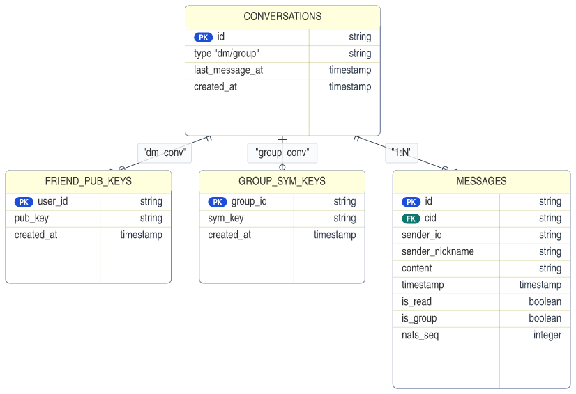

图9 数据库E-R图

**与云端方案的区别**：

本系统的数据存储设计与传统云端方案有本质区别。传统方案中，所有数据存储在云端服务器，服务端掌握所有用户数据；本系统中，所有数据存储在用户本地，服务端只中转加密消息，不存储任何用户数据。这种设计确保用户完全掌控自己的数据，实现了真正的数据主权。

### 4.3.2 消息搜索与历史查询

**历史查询**：系统支持按会话分页查询历史消息。查询时根据会话ID和偏移量获取指定数量的消息，按时间戳升序排列。这种设计支持无限滚动加载，用户滚动到顶部时自动加载更早的消息。

**消息搜索**：系统支持基于关键词的消息搜索功能。搜索时使用SQL的LIKE语句进行模糊匹配，查找内容字段包含关键词的消息。搜索结果按时间戳排序，显示消息所在会话和发送者信息，方便用户定位上下文。

虽然SQLite的LIKE搜索不如专业的全文搜索引擎强大，但对于桌面应用的规模已经足够。如果需要更强大的搜索能力，未来可以考虑集成SQLite的FTS（Full-Text Search）扩展。

### 4.3.3 离线消息同步

离线消息同步是系统的重要功能，保证用户不在线时也能接收消息。

**离线消息存储**：当接收方不在线时，发送方发布的消息会被Hub的JetStream持久化存储。系统为每个用户创建独立的Stream和Consumer，确保消息隔离。

**上线同步流程**：用户上线后，系统执行以下同步流程：首先创建Pull Consumer订阅用户的离线消息主题；然后循环拉取消息，每次拉取一批（如100条）；对于每条消息，解密后保存到本地数据库，并通知前端展示；处理完成后发送ACK确认；继续拉取直到没有新消息。

**消息去重**：由于网络原因可能导致消息重复投递，系统通过消息ID进行去重。保存消息前检查数据库是否已存在相同ID的消息，如果存在则跳过。

**ACK确认**：处理完每条消息后，系统向Hub发送ACK确认。Hub收到ACK后将消息标记为已消费，最终从Stream中删除。

## 4.4 应用集成与前端

### 4.4.1 应用启动流程

应用启动流程是系统正常运行的基础，涉及多个组件的初始化和连接建立。

如图10所示，应用启动流程包含配置加载、LeafNode启动、数据库初始化、NATS连接、聊天服务创建等多个步骤。

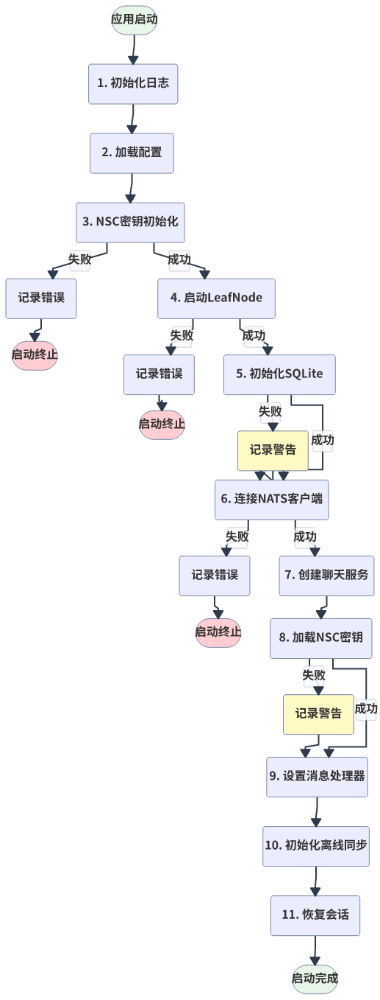

图10 应用启动流程

如图17所示，应用启动后经历离线→连接中→在线→同步中等状态转换。

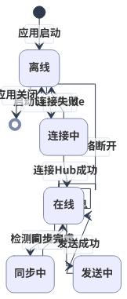

图17 用户状态转换

**启动流程详解**：

（1）**加载配置**：读取~/.dchat/config.json中的配置，包括Hub地址、用户身份信息等。如果配置文件不存在，使用默认配置。

（2）**启动LeafNode**：创建LeafNode管理器，解析Hub URLs，构建Server配置，启动内置NATS Server。如果启动失败（如端口被占用），记录错误并尝试备用端口。

（3）**初始化SQLite**：打开或创建~/.dchat/dchat.db数据库文件，执行数据库迁移（migrations）确保表结构最新。如果数据库损坏，尝试从备份恢复。

（4）**连接NATS客户端**：创建NATS客户端，连接到本地LeafNode（127.0.0.1:4222）。订阅用户的私聊主题和参与的群聊主题。

（5）**创建聊天服务**：初始化聊天服务，设置消息处理回调，加载好友列表和群组信息。

（6）**恢复历史会话**：从数据库加载会话列表，恢复未读消息计数，更新最后消息预览。

**错误处理**：启动流程中各步骤都可能出错，系统采用分级错误处理策略。致命错误（如数据库损坏无法恢复、身份文件丢失）会导致启动失败，提示用户处理；警告性错误（如LeafNode端口被占用切换到备用端口、某个Hub连接失败尝试其他Hub）会记录日志但继续启动。

### 4.4.2 前端界面设计

系统前端采用React + TypeScript技术栈，使用Tailwind CSS进行样式设计。

**界面布局**：界面采用经典的两栏布局：左侧边栏显示会话列表，包含会话名称、最后消息预览、未读消息数；右侧主聊天区显示当前选中会话的消息记录和输入框。

**技术栈选择**：React用于构建用户界面组件，TypeScript提供类型安全，Tailwind CSS提供原子化CSS工具，Wails Runtime API用于与后端通信。

**前后端通信**：Wails提供了Go方法和前端JavaScript之间的自动绑定。前端通过window.go对象调用Go方法，如window.go.main.App.SendDirect()发送私聊消息。后端通过runtime.EventsEmit()向前端推送事件，如收到新消息时触发message-received事件。

### 4.4.3 核心功能实现

**消息发送**：前端调用SendDirect()或SendGroup()方法发送消息。后端接收消息内容，查找接收方公钥或群密钥，加密消息，构造EncWire，通过NATS客户端发布。

**消息接收**：NATS客户端接收到消息后，调用handleIncoming()回调。后端解密消息，保存到数据库，通过EventsEmit通知前端。前端监听message-received事件，更新消息列表。

**会话管理**：创建新会话时，生成cid，保存到conversations表。发送消息时自动创建会话记录。前端根据会话列表渲染侧边栏。

<div style="page-break-after: always;"></div>

# 第5章 系统测试与验证

## 5.1 测试环境

### 5.1.1 硬件环境

系统测试在以下硬件环境中进行：

表3 测试硬件环境

| 设备类型 | 配置 |
|---------|------|
| 开发机/测试机1（Linux）| AMD Ryzen 7 8745HS, 32GB RAM, CachyOS (Kernel 6.19.10) |
| 测试机2（Windows）| Intel CPU, 16GB RAM, Windows 11 |
| 服务器（Hub）| 2核4G云服务器, CentOS 8 |

### 5.1.2 软件环境

表4 测试软件环境

| 软件 | 版本 |
|------|------|
| Go | 1.24.4 |
| Node.js | 18.19.0 |
| NATS Server | 2.12.5 |
| Wails | 2.10.2 |
| React | 18.2.0 |
| SQLite | 3.52.0 |

### 5.1.3 网络拓扑

测试部署了三个Hub节点形成集群：

- Hub1：hub1.example.com:4222
- Hub2：hub2.example.com:4222
- Hub3：hub3.example.com:4222

三节点通过Routes互联形成全mesh集群。测试客户端分别连接不同的Hub节点，验证跨节点消息传输。

## 5.2 功能测试

### 5.2.1 测试用例与结果

表5 功能测试结果

| 功能模块 | 测试项 | 预期结果 | 实际结果 | 状态 |
|---------|-------|---------|---------|------|
| 用户管理 | NSC密钥生成 | 生成operator/account/user密钥 | 生成成功 | 通过 |
| 用户管理 | 身份导入导出 | 导出备份文件可正常导入 | 导入成功，数据完整 | 通过 |
| 网络连接 | LeafNode启动 | 本地NATS Server启动成功 | 启动成功，监听4222 | 通过 |
| 网络连接 | LeafNode连接Hub | 成功建立连接 | 连接成功 | 通过 |
| 认证 | 无鉴权模式连接 | 无需凭证即可连接 | 连接成功 | 通过 |
| 认证 | JWT凭证连接 | 携带user.creds成功连接 | 连接成功 | 通过 |
| 私聊 | 消息发送 | 对方接收并正确解密 | 接收成功，内容正确 | 通过 |
| 私聊 | 跨Hub消息传输 | 连接不同Hub的用户互通 | 消息正常传输 | 通过 |
| 群聊 | 群组创建 | 创建成功，生成群密钥 | 创建成功 | 通过 |
| 群聊 | 群消息收发 | 所有成员接收群消息 | 接收成功 | 通过 |
| 离线消息 | 离线期间消息暂存 | Hub JetStream存储消息 | 存储成功 | 通过 |
| 离线消息 | 上线同步 | 离线期间消息成功拉取 | 拉取成功，无遗漏 | 通过 |
| 离线消息 | 消息去重 | 不显示重复消息 | 无重复 | 通过 |
| 本地存储 | SQLite读写 | 消息持久化，搜索正常 | 读写正常 | 通过 |
| 历史记录 | 分页查询 | 支持滚动加载历史消息 | 加载正常 | 通过 |
| 历史记录 | 关键词搜索 | 正确搜索到包含关键词的消息 | 搜索结果准确 | 通过 |

## 5.3 安全性验证

### 5.3.1 端到端加密验证

使用NATS CLI工具订阅原始消息主题，验证消息为密文：

```bash
# 订阅私聊主题
nats sub dchat.dm.abc123.msg

# 收到的消息示例
{
  "cid": "abc123",
  "sender": "user1",
  "ts": 1714293847,
  "nonce": "8Kj7mN3pQx9vL2sT",
  "cipher": "base64encodedencrypteddata...",
  "nickname": "Alice"
}
```

验证结果：cipher字段为Base64编码的密文，无法直接读取。尝试解密时，缺少正确的私钥和发送方公钥，解密失败。验证了端到端加密的有效性。

### 5.3.2 密钥本地存储验证

检查~/.dchat/目录权限和内容：

```bash
ls -la ~/.dchat/
# 输出显示：
# -rw------- 1 user user  64 user.seed
# -rw------- 1 user user 128 user.creds
```

验证结果：私钥文件权限为600（仅所有者可读写），符合安全要求。服务端不存储任何私钥信息。

### 5.3.3 服务端无数据验证

检查Hub服务器文件系统，确认不存储用户数据：

```bash
# 在Hub服务器上执行
find /var/lib/nats -name "*.db" -o -name "*.json" | grep -E "(user|chat|message)"
# 无输出，确认无用户数据文件
```

验证结果：Hub仅存储JetStream的离线消息（密文形式），不存储任何用户身份信息或明文消息。

### 5.3.4 安全性测试结论

通过以上验证，确认系统实现了以下安全特性：

（1）端到端加密有效，服务端无法解密消息内容。

（2）私钥仅存储在本地，不会泄露到服务端。

（3）服务端无状态设计，不存储用户业务数据。

（4）即使Hub服务器被攻破，攻击者也只能获取密文和元数据，无法获取通信内容。

<div style="page-break-after: always;"></div>

# 第6章 总结与展望

## 6.1 工作总结

本文设计并实现了一个去中心化聊天系统。主要完成的工作包括：

**架构方面**：采用"C/S连接、本地数据"的混合架构。用户通过LeafNode连接Hub集群，但所有数据存储在本地SQLite，服务端不保存任何用户信息。这样既保留了C/S架构的连接稳定性，又避免了P2P的NAT穿透问题。

**通信方面**：实现了基于NATS的消息传输。每个应用内置一个LeafNode，连接到Hub集群；多个Hub通过Routes组成全mesh网络；利用JetStream实现离线消息存储和同步。

**安全方面**：使用Ed25519密钥进行身份认证，派生X25519密钥进行消息加密。私聊采用NaCl Box端到端加密，群聊采用AES-256-GCM对称加密。密钥全部本地存储，不上传服务器。

**存储方面**：用SQLite保存聊天记录、好友公钥、群组密钥等。支持按会话查询历史消息，支持关键词搜索。

**应用方面**：使用Wails框架开发桌面应用，Go写后端，React写前端。已在Windows和Linux上测试通过。

测试结果显示，系统各功能运行正常，加密有效，服务端确实不存储用户数据。

## 6.2 创新点

（1）服务端只转发消息，不处理业务逻辑，也不存储用户数据。即使服务器被攻破，攻击者也只能拿到密文。

（2）在C/S架构下实现了数据主权回归用户。聊天记录、联系人等全部本地保存，用户对自己的数据有完全控制权。

（3）Hub集群采用Routes全mesh互联，没有中心节点，任一Hub故障不影响整体服务。

（4）身份认证和消息加密使用不同的密钥。Ed25519用于签名认证，X25519用于加密，两个密钥从同一种子派生但互相独立。

## 6.3 存在的不足

（1）运行公网Hub需要服务器，对个人用户来说有一定成本。

（2）群聊功能比较简单，缺少管理员权限、成员管理等高级功能。

（3）只有桌面版，没有手机App。

（4）账号和聊天记录绑定在一台电脑上，换设备需要重新导入数据。

（5）只能发文字，不能发图片、文件等。

## 6.4 未来展望

（1）开发iOS和Android客户端，让手机也能用。

（2）用NATS Gateway连接不同的Hub集群，形成更大的网络。

（3）增加文件传输功能，可以发图片、文档等。

（4）实现多设备同步，让账号可以在电脑和手机之间切换。

（5）集成DID（去中心化身份），实现跨平台身份认证。

（6）完善群聊功能，增加管理员、公告、撤回消息等。

（7）建立Hub共享机制，让用户可以共用Hub资源，降低使用成本。

<div style="page-break-after: always;"></div>

# 致 谢

感谢我的指导老师在论文选题、系统设计和论文撰写过程中给予的指导和帮助。

感谢计算机科学与技术学院的各位老师，四年来的专业课程为完成本论文奠定了基础。

感谢开源社区，本项目使用NATS、Wails、React等开源项目构建。

感谢家人在求学期间给予的支持。

<div style="page-break-after: always;"></div>

# 参考文献

[1] Daniel J. Bernstein, Tanja Lange, Peter Schwabe. The security impact of a new cryptographic library[C]. International Conference on Cryptology and Information Security in Latin America, 2012: 159-176.

[2] Daniel J. Bernstein. Curve25519: New Diffie-Hellman speed records[C]. International Workshop on Public Key Cryptography, 2006: 207-228.

[3] Daniel J. Bernstein, Niels Duif, Tanja Lange, et al. High-speed high-security signatures[J]. Journal of Cryptographic Engineering, 2012, 2(2): 77-89.

[4] The NATS Authors. NATS Documentation[EB/OL]. <https://docs.nats.io/>, 2024.

[5] Wails Team. Wails Documentation[EB/OL]. <https://wails.io/docs/introduction>, 2024.

[6] Signal Foundation. The Double Ratchet Algorithm[EB/OL]. <https://signal.org/docs/specifications/doubleratchet/>, 2016.

[7] Moxie Marlinspike, Trevor Perrin. The X3DH Key Agreement Protocol[EB/OL]. <https://signal.org/docs/specifications/x3dh/>, 2016.

[8] Matrix.org Foundation. Matrix Specification[EB/OL]. <https://spec.matrix.org/>, 2024.

[9] Peter Saint-Andre. Extensible Messaging and Presence Protocol (XMPP): Core[S]. RFC 6120, 2011.

[10] 王小云, 于红波. 密码学研究进展[J]. 科学通报, 2020, 65(7): 598-611.
