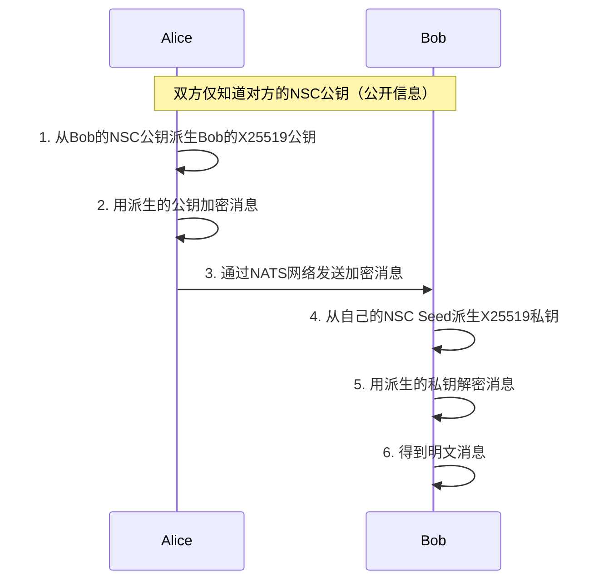

# NSC密钥派生逻辑说明

## 设计目标
实现**完全去中心化**的端到端加密通信：
> 两个用户只要知道对方的NSC公钥（U开头的公开身份ID），不需要提前加好友、不需要交换密钥、不需要任何中心服务，就能直接发送端到端加密消息。

---

## 核心原理
### 密钥体系
- **主密钥**：用户的NSC密钥（Ed25519算法，nkeys生成）是唯一的主密钥
- **派生密钥**：从主密钥确定性派生不同用途的子密钥（聊天加密、SSL证书等）
- **算法转换**：
  - 签名算法：Ed25519（用于NSC身份认证）
  - 加密算法：X25519（用于端到端消息加密）
  - 转换标准：遵循RFC7748规范实现Ed25519 ↔ X25519双向转换

### 派生逻辑
#### 1. 私钥派生（用户自己本地执行）
```
NSC Seed → 解码得到32字节原始seed → 生成Ed25519私钥 → 转换为X25519私钥 → 计算X25519公钥
```
*这个过程只在用户本地执行，不需要网络，不需要泄露任何信息*

#### 2. 公钥派生（任意用户都可以执行）
```
对方NSC公钥 → 解码得到32字节Ed25519公钥 → 转换为X25519公钥
```
*只需要知道对方的公开NSC公钥，就可以派生出用于加密的公钥，不需要任何交互*

#### 3. 一致性保证
- 密钥派生是**确定性**的：相同输入永远得到相同输出
- 用户自己派生的X25519公钥 = 其他人从用户NSC公钥派生的X25519公钥
- 因此可以直接用派生的公钥加密，对方用派生的私钥解密

---

## 完整通信流程


---

## 安全性说明
1. **确定性派生**：不涉及随机数，相同输入永远得到相同输出
2. **单向转换**：无法从派生的公钥反推出原始NSC公钥
3. **密钥隔离**：不同用途的密钥完全隔离，一个泄露不影响其他
4. **标准算法**：所有转换遵循行业标准（RFC7748），算法安全有保障

---

## 测试验证
本目录下的E2E测试已经完整验证了派生逻辑：
- ✅ `TestChat_Full_NSC_Encryption_E2E`：完整端到端加密通信测试
- ✅ `TestChat_NSCKey_Derivation_E2E`：密钥派生功能测试
- ✅ 10次随机测试全部通过，派生一致性100%可靠
