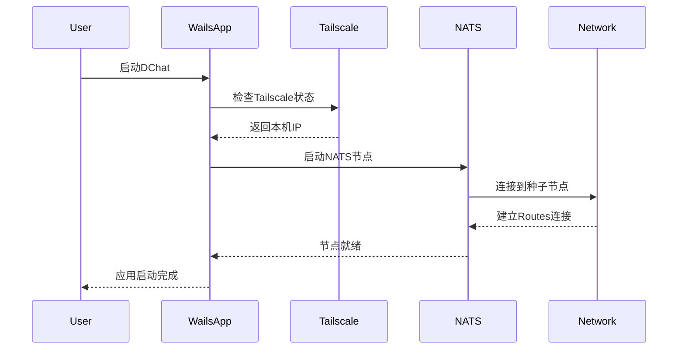

# 去中心化聊天室 - DChat

## 项目概述

基于 **NATS Routes集群 + Tailscale + Wails** 构建的真正去中心化聊天室应用。

### 核心特性
- 🌐 **真正去中心化**：基于NATS Routes集群，无固定服务器节点
- 🔗 **链式连接**：支持A→B→C自动发现，动态网络拓扑
- 🛡️ **安全联网**：Tailscale提供零配置P2P加密通信
- 🖥️ **跨平台客户端**：Wails框架打造现代化桌面应用
- ⚡ **自动发现**：节点自动形成全网状网络，无需手动配置

## 技术架构

### 整体架构设计

```
用户设备A                用户设备B                用户设备C
┌──────────────┐        ┌──────────────┐        ┌──────────────┐
│   DChat App  │        │   DChat App  │        │   DChat App  │
│   (Wails)    │        │   (Wails)    │        │   (Wails)    │
├──────────────┤        ├──────────────┤        ├──────────────┤
│ NATS Server  │◄──────►│ NATS Server  │◄──────►│ NATS Server  │
│  (Routes)    │        │  (Routes)    │        │  (Routes)    │
├──────────────┤        ├──────────────┤        ├──────────────┤
│  Tailscale   │        │  Tailscale   │        │  Tailscale   │
│   Network    │        │   Network    │        │   Network    │
└──────────────┘        └──────────────┘        └──────────────┘
       │                        │                        │
       └────────────────────────┼────────────────────────┘
                                │
                     ┌──────────────┐
                     │  Tailscale   │
                     │   Mesh VPN   │
                     └──────────────┘
```

### 技术栈选择

#### 1. NATS Routes集群
- **用途**：实现真正去中心化的消息路由
- **优势**：
  - ✅ 支持链式连接（A→B→C自动发现）
  - ✅ 动态网络拓扑，无单点故障
  - ✅ 配置简单，只需种子节点地址
  - ✅ 自动形成全网状网络

#### 2. Tailscale网络
- **用途**：提供安全的P2P网络连接
- **优势**：
  - ✅ 零配置WireGuard VPN
  - ✅ 自动NAT穿透
  - ✅ 端到端加密
  - ✅ 跨平台支持
  - ✅ 网络自动发现

#### 3. Wails框架
- **用途**：构建现代化桌面应用
- **优势**：
  - ✅ Go后端 + Web前端
  - ✅ 原生性能
  - ✅ 跨平台打包
  - ✅ 热重载开发
  - ✅ 系统集成能力

## 核心特性详解

### 1. 去中心化网络拓扑

基于NATS Routes的去中心化设计：

```
初始状态：NodeA (种子节点)
┌─────────┐
│ Node A  │
└─────────┘

添加NodeB：A←→B
┌─────────┐    ┌─────────┐
│ Node A  │◄──►│ Node B  │
└─────────┘    └─────────┘

添加NodeC：A←→B←→C，A自动发现C
┌─────────┐    ┌─────────┐    ┌─────────┐
│ Node A  │◄──►│ Node B  │◄──►│ Node C  │
└─────────┘    └─────────┘    └─────────┘
      ▲                              │
      └──────────────────────────────┘
              自动建立连接

最终形成全网状网络：每个节点都与其他节点连接
```

**关键特性：**
- 🎯 **链式连接**：新节点只需连接任一现有节点
- 🎯 **自动发现**：Routes协议自动建立全连通网络
- 🎯 **动态自愈**：节点故障时自动从网络移除
- 🎯 **无中心节点**：所有节点地位平等

### 2. Tailscale安全网络

解决公网连接和安全问题：

```
传统方案（FRP）的问题：
❌ 需要公网服务器
❌ 端口映射复杂
❌ 安全性依赖配置
❌ 单点故障风险

Tailscale方案优势：
✅ P2P直连，无需中转
✅ 自动NAT穿透
✅ WireGuard加密
✅ 零配置安全
```

**Tailscale集成方式：**
- 每个用户设备加入Tailscale网络
- NATS节点通过Tailscale IP互连
- 自动获得加密和认证
- 支持动态IP变化

### 3. Wails应用架构

现代化桌面应用设计：

```
┌─────────────────────────────────────┐
│              前端 (Web)              │
│  Vue.js / React / Vanilla JS       │
├─────────────────────────────────────┤
│             Wails Bridge            │
├─────────────────────────────────────┤
│              后端 (Go)              │
│  ├─ NATS客户端                      │
│  ├─ Tailscale集成                   │
│  ├─ 消息加密/解密                    │
│  ├─ 用户管理                        │
│  └─ 系统集成                        │
└─────────────────────────────────────┘
```

## 实现方案

### 配置示例

#### 1. NATS Routes配置

**基础节点配置：**
```conf
# nats-node.conf
# 客户端连接端口
port: 4222
server_name: "dchat-node-{user_id}"

# Routes集群配置
cluster: {
  name: "dchat_network"
  # 集群端口
  port: 6222
  # 连接到种子节点（Tailscale IP）
  routes: [
    "nats://100.64.1.100:6222"  # 种子节点的Tailscale IP
  ]
}

# 账户和权限配置
include "accounts.conf"
```

**启动脚本：**
```bash
#!/bin/bash
# start-dchat-node.sh

# 获取本机Tailscale IP
TAILSCALE_IP=$(tailscale ip -4)

# 启动NATS服务器
nats-server \
  -p 4222 \
  -cluster "nats://${TAILSCALE_IP}:6222" \
  -routes "nats://seed-node-tailscale-ip:6222" \
  -server_name "dchat-${USER}-$(hostname)"
```

#### 2. Tailscale集成

**自动Tailscale配置：**
```go
// internal/network/tailscale.go
package network

import (
    "context"
    "tailscale.com/client/tailscale"
)

type TailscaleManager struct {
    client *tailscale.Client
}

func (tm *TailscaleManager) GetLocalIP() (string, error) {
    status, err := tm.client.Status(context.Background())
    if err != nil {
        return "", err
    }
    return status.Self.TailscaleIPs[0].String(), nil
}

func (tm *TailscaleManager) GetPeerIPs() ([]string, error) {
    status, err := tm.client.Status(context.Background())
    if err != nil {
        return nil, err
    }
    
    var ips []string
    for _, peer := range status.Peer {
        if len(peer.TailscaleIPs) > 0 {
            ips = append(ips, peer.TailscaleIPs[0].String())
        }
    }
    return ips, nil
}
```

#### 3. Wails应用结构

**项目结构：**
```
dchat/
├── app.go                 # Wails应用入口
├── build/                 # 构建输出
├── frontend/              # 前端代码
│   ├── dist/
│   ├── index.html
│   ├── src/
│   │   ├── main.js
│   │   ├── components/
│   │   └── styles/
├── internal/              # 内部包
│   ├── nats/             # NATS客户端
│   ├── network/          # Tailscale集成
│   ├── crypto/           # 消息加密
│   ├── chat/             # 聊天逻辑
│   └── config/           # 配置管理
├── wails.json            # Wails配置
└── main.go               # 程序入口
```

**主应用代码：**
```go
// app.go
package main

import (
    "context"
    "dchat/internal/chat"
    "dchat/internal/nats"
    "dchat/internal/network"
)

type App struct {
    ctx        context.Context
    chatSvc    *chat.Service
    natsSvc    *nats.Service
    tailscale  *network.TailscaleManager
}

func NewApp() *App {
    return &App{}
}

func (a *App) OnStartup(ctx context.Context) {
    a.ctx = ctx
    
    // 初始化Tailscale
    a.tailscale = network.NewTailscaleManager()
    
    // 初始化NATS
    localIP, _ := a.tailscale.GetLocalIP()
    a.natsSvc = nats.NewService(localIP)
    
    // 初始化聊天服务
    a.chatSvc = chat.NewService(a.natsSvc)
}

// 前端调用的方法
func (a *App) JoinChatRoom(roomName string) error {
    return a.chatSvc.JoinRoom(roomName)
}

func (a *App) SendMessage(roomName, message string) error {
    return a.chatSvc.SendMessage(roomName, message)
}

func (a *App) GetChatHistory(roomName string) ([]chat.Message, error) {
    return a.chatSvc.GetHistory(roomName)
}
```

### 启动流程

#### 1. 应用启动序列



#### 2. 节点发现流程

```bash
# 第一个用户启动（种子节点）
User A: 启动DChat → 成为种子节点（100.64.1.100:6222）

# 第二个用户加入
User B: 启动DChat → 连接到种子节点 → 形成A←→B网络

# 第三个用户加入
User C: 启动DChat → 连接到B节点 → Routes自动发现A
结果：形成A←→B←→C全连通网络

# 后续用户加入
User D: 连接到任意现有节点 → 自动加入全网状网络
```

#### 3. 消息路由示例

```go
// 用户A发送消息到聊天室"general"
UserA.SendMessage("general", "Hello everyone!")

// NATS Routes自动路由到所有节点
// 所有订阅"chat.general"主题的用户都会收到消息
```

## 高级功能

### 1. 消息加密

```go
// internal/crypto/encryption.go
package crypto

import (
    "crypto/aes"
    "crypto/cipher"
    "crypto/rand"
    "crypto/sha256"
    "encoding/base64"
)

type MessageCrypto struct {
    gcm cipher.AEAD
}

func NewMessageCrypto(password string) (*MessageCrypto, error) {
    // 从密码生成密钥
    key := sha256.Sum256([]byte(password))
    
    block, err := aes.NewCipher(key[:])
    if err != nil {
        return nil, err
    }
    
    gcm, err := cipher.NewGCM(block)
    if err != nil {
        return nil, err
    }
    
    return &MessageCrypto{gcm: gcm}, nil
}

func (mc *MessageCrypto) Encrypt(plaintext string) (string, error) {
    nonce := make([]byte, mc.gcm.NonceSize())
    rand.Read(nonce)
    
    ciphertext := mc.gcm.Seal(nonce, nonce, []byte(plaintext), nil)
    return base64.StdEncoding.EncodeToString(ciphertext), nil
}
```

### 2. 用户身份管理

```go
// internal/identity/user.go
package identity

import (
    "crypto/ed25519"
    "encoding/base64"
    "time"
)

type User struct {
    ID        string    `json:"id"`
    Nickname  string    `json:"nickname"`
    PublicKey string    `json:"public_key"`
    Avatar    string    `json:"avatar"`
    CreatedAt time.Time `json:"created_at"`
}

type IdentityManager struct {
    privateKey ed25519.PrivateKey
    publicKey  ed25519.PublicKey
    user       *User
}

func (im *IdentityManager) SignMessage(message []byte) string {
    signature := ed25519.Sign(im.privateKey, message)
    return base64.StdEncoding.EncodeToString(signature)
}

func (im *IdentityManager) VerifyMessage(publicKey, message, signature string) bool {
    pubKey, _ := base64.StdEncoding.DecodeString(publicKey)
    sig, _ := base64.StdEncoding.DecodeString(signature)
    return ed25519.Verify(pubKey, []byte(message), sig)
}
```

### 3. 聊天室管理

```go
// internal/chat/room.go
package chat

import (
    "encoding/json"
    "time"
)

type Message struct {
    ID        string    `json:"id"`
    RoomID    string    `json:"room_id"`
    UserID    string    `json:"user_id"`
    Username  string    `json:"username"`
    Content   string    `json:"content"`
    Signature string    `json:"signature"`
    Timestamp time.Time `json:"timestamp"`
    Type      string    `json:"type"` // text, image, file
}

type Room struct {
    ID          string     `json:"id"`
    Name        string     `json:"name"`
    Description string     `json:"description"`
    Members     []string   `json:"members"`
    Messages    []*Message `json:"messages"`
    CreatedAt   time.Time  `json:"created_at"`
}

type ChatService struct {
    nats   *nats.Service
    crypto *crypto.MessageCrypto
    user   *identity.User
    rooms  map[string]*Room
}

func (cs *ChatService) JoinRoom(roomName string) error {
    // 订阅聊天室主题
    subject := fmt.Sprintf("chat.%s", roomName)
    return cs.nats.Subscribe(subject, cs.handleMessage)
}

func (cs *ChatService) SendMessage(roomName, content string) error {
    msg := &Message{
        ID:        generateID(),
        RoomID:    roomName,
        UserID:    cs.user.ID,
        Username:  cs.user.Nickname,
        Content:   content,
        Timestamp: time.Now(),
        Type:      "text",
    }
    
    // 消息签名
    msgBytes, _ := json.Marshal(msg)
    msg.Signature = cs.user.SignMessage(msgBytes)
    
    // 发布到NATS
    subject := fmt.Sprintf("chat.%s", roomName)
    return cs.nats.Publish(subject, msg)
}
```

### 4. 前端界面设计

**Vue.js聊天界面：**
```vue
<!-- frontend/src/components/ChatRoom.vue -->
<template>
  <div class="chat-room">
    <!-- 聊天室头部 -->
    <div class="room-header">
      <h3>{{ roomName }}</h3>
      <div class="online-users">
        <span v-for="user in onlineUsers" :key="user.id" class="user-badge">
          {{ user.nickname }}
        </span>
      </div>
    </div>
    
    <!-- 消息列表 -->
    <div class="messages" ref="messagesContainer">
      <div v-for="msg in messages" :key="msg.id" class="message">
        <div class="message-header">
          <span class="username">{{ msg.username }}</span>
          <span class="timestamp">{{ formatTime(msg.timestamp) }}</span>
        </div>
        <div class="message-content">{{ msg.content }}</div>
      </div>
    </div>
    
    <!-- 输入框 -->
    <div class="input-area">
      <input 
        v-model="newMessage" 
        @keyup.enter="sendMessage"
        placeholder="输入消息..."
        class="message-input"
      />
      <button @click="sendMessage" class="send-button">发送</button>
    </div>
  </div>
</template>

<script>
import { ref, onMounted, nextTick } from 'vue'

export default {
  name: 'ChatRoom',
  props: ['roomName'],
  setup(props) {
    const messages = ref([])
    const newMessage = ref('')
    const onlineUsers = ref([])
    const messagesContainer = ref(null)

    const sendMessage = async () => {
      if (!newMessage.value.trim()) return
      
      // 调用Go后端方法
      await window.go.main.App.SendMessage(props.roomName, newMessage.value)
      newMessage.value = ''
    }

    const loadMessages = async () => {
      const history = await window.go.main.App.GetChatHistory(props.roomName)
      messages.value = history
      await nextTick()
      scrollToBottom()
    }

    const scrollToBottom = () => {
      const container = messagesContainer.value
      container.scrollTop = container.scrollHeight
    }

    const formatTime = (timestamp) => {
      return new Date(timestamp).toLocaleTimeString()
    }

    onMounted(() => {
      loadMessages()
      // 订阅消息更新
      window.runtime.EventsOn('new-message', (msg) => {
        if (msg.room_id === props.roomName) {
          messages.value.push(msg)
          nextTick(() => scrollToBottom())
        }
      })
    })

    return {
      messages,
      newMessage,
      onlineUsers,
      messagesContainer,
      sendMessage,
      formatTime
    }
  }
}
</script>
```

## 部署和使用

### 1. 环境准备

**安装依赖：**
```bash
# 安装Tailscale
curl -fsSL https://tailscale.com/install.sh | sh
sudo tailscale up

# 安装NATS Server
go install github.com/nats-io/nats-server/v2@latest

# 安装Wails
go install github.com/wailsapp/wails/v2/cmd/wails@latest
```

### 2. 构建应用

```bash
# 克隆项目
git clone https://github.com/your-org/dchat.git
cd dchat

# 构建开发版本
wails dev

# 构建生产版本
wails build
```

### 3. 首次使用

```bash
# 1. 确保Tailscale已连接
tailscale status

# 2. 启动DChat应用
./build/bin/dchat

# 3. 应用自动：
#    - 检测Tailscale网络
#    - 启动NATS节点
#    - 连接到现有网络或创建新网络
#    - 开始聊天！
```

### 4. 网络拓扑示例

**小型团队（3-5人）：**
```
Alice (种子) ←→ Bob ←→ Charlie
     ↑                    ↓
     └──────── Diana ←────┘
```

**大型社区（10+人）：**
```
     Alice ←→ Bob ←→ Charlie
       ↑        ↑        ↓
    Diana ←→ Eve ←→ Frank ←→ Grace
       ↑        ↑        ↓
     Henry ←→ Ivan ←→ Jack
```

**全连通网络**：每个节点都能直接通信，消息延迟最低。

## 开发路线图

### Phase 1: 核心功能 (已完成)
- ✅ NATS Routes集群研究和验证
- ✅ 链式连接原理验证
- ✅ 基础Demo实现

### Phase 2: Tailscale集成 (进行中)
- 🔄 Tailscale网络检测和集成
- 🔄 自动IP发现机制
- ⏳ 网络状态监控

### Phase 3: Wails应用开发 (计划中)
- ⏳ 项目结构搭建
- ⏳ Go后端服务架构
- ⏳ Vue.js前端界面
- ⏳ NATS客户端集成

### Phase 4: 聊天功能 (计划中)
- ⏳ 消息加密/解密
- ⏳ 用户身份管理
- ⏳ 聊天室管理
- ⏳ 文件传输支持

### Phase 5: 高级特性 (计划中)
- ⏳ 离线消息同步
- ⏳ 消息历史搜索
- ⏳ 群组权限管理
- ⏳ 插件系统

### Phase 6: 优化和发布 (计划中)
- ⏳ 性能优化
- ⏳ 跨平台测试
- ⏳ 打包和分发
- ⏳ 文档完善

## 技术优势总结

### 🎯 完全去中心化
- **无单点故障**：任意节点离线不影响网络
- **无固定服务器**：所有节点地位平等
- **自动网络发现**：新节点自动加入现有网络
- **动态自愈能力**：故障节点自动从网络移除

### 🔒 企业级安全
- **端到端加密**：Tailscale WireGuard加密
- **消息签名**：Ed25519数字签名验证身份
- **零信任架构**：不依赖中心化身份认证
- **网络隔离**：Tailscale提供网络层隔离

### ⚡ 极简配置
- **零配置网络**：Tailscale自动NAT穿透
- **一键启动**：Wails一键启动所有服务
- **自动发现**：NATS Routes自动建立连接
- **热插拔**：节点可随时加入/离开

### 🚀 现代化体验
- **原生性能**：Wails提供接近原生的性能
- **跨平台支持**：Windows/macOS/Linux统一体验
- **现代UI**：基于Web技术的灵活界面
- **实时通信**：NATS提供毫秒级消息延迟

## 参考资料

### 官方文档
- [NATS Routes官方文档](https://docs.nats.io/running-a-nats-service/configuration/clustering)
- [Tailscale官方文档](https://tailscale.com/kb/)
- [Wails框架文档](https://wails.io/docs/introduction)

### 技术研究
- [NATS Routes集群深度分析](./cmd/routes/routes.md)
- [TestChainedSolicitWorks源码分析](https://github.com/nats-io/nats-server/blob/main/test/route_discovery_test.go)

### 相关项目
- [nats-io/nats-server](https://github.com/nats-io/nats-server)
- [tailscale/tailscale](https://github.com/tailscale/tailscale)
- [wailsapp/wails](https://github.com/wailsapp/wails)

---

**项目愿景**：构建一个真正去中心化、安全、易用的现代聊天平台，让每个人都能拥有自己的通信网络。

**开始时间**：2025年8月3日  
**技术栈**：NATS Routes + Tailscale + Wails + Go + Vue.js  
**核心特性**：去中心化、链式连接、零配置、企业级安全