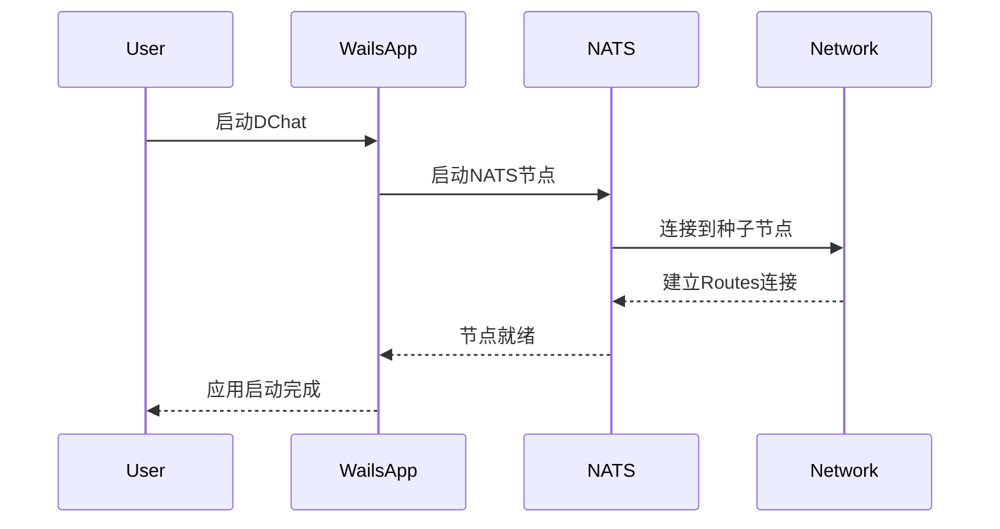

### 跨公网/局域网混合拓扑指引

公共节点（有公网 IP，暴露 cluster 端口）示例：
```bash
./chatpeer --client-port 4222 --cluster-port 6222 \
  --cluster-advertise 1.2.3.4:6222
```

局域网节点（通过公共节点的 advertise 地址作为种子加入）：
```bash
./chatpeer --client-port 4322 --cluster-port 6322 \
  --seed-route nats://1.2.3.4:6222
```

随后按双向加密私聊流程互换 userID/PubKey，并以 --identity 保持稳定身份重复使用。
```

## 运行演示
```bash
cd DecentralizedChat
go run examples/cluster_demo.go
```

## 新 API 特点
- 零硬编码：所有网络配置都通过参数传入
- 自动配置：自动检测本地 IP，自动生成 NATS URL
- 强类型：配置验证确保运行时安全
- 简洁API：移除冗余的向后兼容接口
# 去中心化聊天室 - DChat

## 项目概述

基于 **NATS Routes集群 + Wails** 构建的真正去中心化聊天室应用。

### 核心特性
- ⚡ **自动发现**：节点自动形成全网状网络，无需手动配置

## 技术架构

### 整体架构设计

```
用户设备A                用户设备B                用户设备C
│  (Routes)    │        │  (Routes)    │        │  (Routes)    │
│   Network    │        │   Network    │        │   Network    │
└──────────────┘        └──────────────┘        └──────────────┘
       │                        │                        │
       └────────────────────────┼────────────────────────┘
                                │
                     ┌──────────────┐
                     │   NATS Mesh   │
                     │   Network     │
                     └──────────────┘
```

### 技术栈选择

#### 1. NATS Routes集群
- **用途**：实现真正去中心化的消息路由
- **优势**：
  - ✅ 支持链式连接（A→B→C自动发现）
  - ✅ 动态网络拓扑，无单点故障
  - ✅ 配置简单，只需种子节点地址
  - ✅ 自动形成全网状网络

#### 2. Wails框架
- **用途**：构建现代化桌面应用
- **优势**：
  - ✅ Go后端 + React前端
  - ✅ 原生性能
  - ✅ 跨平台打包
  - ✅ 热重载开发
  - ✅ 系统集成能力

## 核心特性详解

### 1. 去中心化网络拓扑

基于NATS Routes的去中心化设计：

```
初始状态：NodeA (种子节点)
┌─────────┐
│ Node A  │
└─────────┘

添加NodeB：A←→B
┌─────────┐    ┌─────────┐
│ Node A  │◄──►│ Node B  │
└─────────┘    └─────────┘

添加NodeC：A←→B←→C，A自动发现C
┌─────────┐    ┌─────────┐    ┌─────────┐
│ Node A  │◄──►│ Node B  │◄──►│ Node C  │
└─────────┘    └─────────┘    └─────────┘
      ▲                              │
      └──────────────────────────────┘
              自动建立连接

最终形成全网状网络：每个节点都与其他节点连接
```

**关键特性：**
- 🎯 **链式连接**：新节点只需连接任一现有节点
- 🎯 **自动发现**：Routes协议自动建立全连通网络
- 🎯 **动态自愈**：节点故障时自动从网络移除
- 🎯 **无中心节点**：所有节点地位平等

### 3. Wails应用架构

现代化桌面应用设计：

```
┌─────────────────────────────────────┐
│             前端 (React)            │
│         React.js + JSX             │
├─────────────────────────────────────┤
│             Wails Bridge            │
├─────────────────────────────────────┤
│              后端 (Go)              │
│  ├─ NATS客户端                      │
│  ├─ 消息加密/解密                    │
│  ├─ 用户管理                        │
│  └─ 系统集成                        │
└─────────────────────────────────────┘
```

## 实现方案

### 配置示例

#### 1. NATS Routes配置

**基础节点配置：**
```conf
# nats-node.conf
# 客户端连接端口
port: 4222
server_name: "dchat-node-{user_id}"

# Routes集群配置
cluster: {
  name: "dchat_network"
  # 集群端口
  port: 6222
  # 连接到种子节点
  routes: [
    "nats://seed-node-ip:6222"  # 种子节点的IP地址
  ]
}

# 账户和权限配置
include "accounts.conf"
```

**启动脚本：**
```bash
#!/bin/bash
# start-dchat-node.sh

# 启动NATS服务器
nats-server \
  -p 4222 \
  -cluster "nats://local-ip:6222" \
  -routes "nats://seed-node-ip:6222" \
  -server_name "dchat-${USER}-$(hostname)"
```

#### 2. Wails应用结构

**项目结构：**
```
dchat/
├── app.go                 # Wails应用入口
├── build/                 # 构建输出
├── frontend/              # 前端代码
│   ├── dist/
│   ├── index.html
│   ├── src/
│   │   ├── main.jsx       # React入口文件
│   │   ├── App.jsx        # 主应用组件
│   │   ├── components/    # React组件
│   │   │   ├── ChatRoom.jsx
│   │   │   ├── Sidebar.jsx
│   │   │   └── UserList.jsx
│   │   └── styles/        # CSS样式
│   │       ├── App.css
│   │       └── components/
│   ├── package.json       # Node.js依赖
│   └── vite.config.js     # Vite配置
├── wailsjs/               # Wails生成的JS绑定
│   ├── go/
│   └── runtime/
├── internal/              # 内部包
│   ├── nats/             # NATS客户端
│   ├── crypto/           # 消息加密
│   ├── chat/             # 聊天逻辑
│   └── config/           # 配置管理
├── wails.json            # Wails配置
└── main.go               # 程序入口
```

**主应用代码：**

### 启动流程

#### 1. 应用启动序列



#### 2. 节点发现流程

```bash
# 第一个用户启动（种子节点）
User A: 启动DChat → 成为种子节点（local-ip:6222）

# 第二个用户加入
User B: 启动DChat → 连接到种子节点 → 形成A←→B网络

# 第三个用户加入
User C: 启动DChat → 连接到B节点 → Routes自动发现A
结果：形成A←→B←→C全连通网络

# 后续用户加入
User D: 连接到任意现有节点 → 自动加入全网状网络
```

#### 3. 消息路由示例

```go
// 用户A发送消息到聊天室"general"
UserA.SendMessage("general", "Hello everyone!")

// NATS Routes自动路由到所有节点
// 所有订阅"chat.general"主题的用户都会收到消息
```

## 高级功能

### 1. 消息加密

### 2. 用户身份管理

### 3. 聊天室管理

### 4. 前端界面设计

**React.js聊天界面：**

## 部署和使用

### 1. 环境准备
 
## 操作日志追加
- 实现 AddSubscribePermission: 支持新增订阅权限，写入 <nodeID>_node_config.json 并自动重启节点应用新权限
- 重构 config.go：新增扁平 server 配置(ServerOptionsLite)，与原 NATS/Routes 字段同步，提供 BuildServerOptions() 直接生成 server.Options，减少嵌套层级。
- 二次重构 config：移除 RoutesConfig 与大部分嵌套字段，保留 Server(服务端) + NATS(向后兼容少量字段)；后续将逐步淘汰 NATS/旧权限字段，统一使用 Server + Auth 扁平结构。
- 精简 routes.NodeConfig：删除多层 Permissions/Routes/SubjectPermission 结构，保留 ImportAllow/ExportAllow 扁平字段，AddSubscribePermission 逻辑同步简化。

**安装依赖：**
```bash
# 安装NATS Server
go install github.com/nats-io/nats-server/v2@latest

# 安装Wails
go install github.com/wailsapp/wails/v2/cmd/wails@latest
```

### 2. 构建应用

```bash
# 克隆项目
git clone https://github.com/your-org/dchat.git
cd dchat

# 安装前端依赖
cd frontend
pnpm install
cd ..

# 构建开发版本（支持热重载）
wails dev

# 构建生产版本
wails build
```

### 3. 首次使用

```bash

# 2. 启动DChat应用
./build/bin/dchat

```

### 4. 网络拓扑示例

**小型团队（3-5人）：**
```
Alice (种子) ←→ Bob ←→ Charlie
     ↑                    ↓
     └──────── Diana ←────┘
```

**大型社区（10+人）：**
```
     Alice ←→ Bob ←→ Charlie
       ↑        ↑        ↓
    Diana ←→ Eve ←→ Frank ←→ Grace
       ↑        ↑        ↓
     Henry ←→ Ivan ←→ Jack
```

**全连通网络**：每个节点都能直接通信，消息延迟最低。

## 开发路线图

### Phase 1: 核心功能 (已完成)
- ✅ NATS Routes集群研究和验证
- ✅ 链式连接原理验证
- ✅ 基础Demo实现

### Phase 3: Wails应用开发 (计划中)
- ⏳ 项目结构搭建
- ⏳ Go后端服务架构
- ⏳ React.js前端界面
- ⏳ NATS客户端集成

### Phase 4: 聊天功能 (计划中)
- ⏳ 消息加密/解密
- ⏳ 用户身份管理
- ⏳ 聊天室管理
- ⏳ 文件传输支持

### Phase 5: 优化和发布 (计划中)
- ⏳ 性能优化
- ⏳ 跨平台测试
- ⏳ 打包和分发
- ⏳ 文档完善

## 技术优势总结

### 🎯 完全去中心化
- **无单点故障**：任意节点离线不影响网络
- **无固定服务器**：所有节点地位平等
- **自动网络发现**：新节点自动加入现有网络
- **动态自愈能力**：故障节点自动从网络移除

### 🔒 企业级安全
- **消息签名**：Ed25519数字签名验证身份
- **零信任架构**：不依赖中心化身份认证

### ⚡ 极简配置
- **一键启动**：Wails一键启动所有服务
- **自动发现**：NATS Routes自动建立连接
- **热插拔**：节点可随时加入/离开

### 🚀 现代化体验
- **原生性能**：Wails提供接近原生的性能
- **跨平台支持**：Windows/macOS/Linux统一体验
- **现代UI**：基于Web技术的灵活界面
- **实时通信**：NATS提供毫秒级消息延迟

## 参考资料

### 官方文档
- [NATS Routes官方文档](https://docs.nats.io/running-a-nats-service/configuration/clustering)
- [Wails框架文档](https://wails.io/docs/introduction)

### 技术研究
- [NATS Routes集群深度分析](./cmd/routes/routes.md)
- [TestChainedSolicitWorks源码分析](https://github.com/nats-io/nats-server/blob/main/test/route_discovery_test.go)

### 相关项目
- [nats-io/nats-server](https://github.com/nats-io/nats-server)
- [wailsapp/wails](https://github.com/wailsapp/wails)

---

**项目愿景**：构建一个真正去中心化、安全、易用的现代聊天平台，让每个人都能拥有自己的通信网络。

**开始时间**：2025年8月3日  
**技术栈**：NATS Routes + Wails + Go + React.js  
**核心特性**：去中心化、链式连接、零配置、企业级安全

TODO:
1. 因为每个nats是消息队列,每个节点通过subject与集群通信,每个节点默认publish-subject: all-allow, subscribe subject: all-deny. ok
2.  客户端连接使用公私钥而不是帐号密码,使用nsc生成jwt token ok
3.  用户可以自行添加allow subscribe subject,会被写入到本地的config.json持久化, 本地配置文件存储信任的公钥路径列表 ok
4. nsc自动生成凭证用于本地连接 ok
5.  研究creds,jwt,nkey的关系和作用 ok
6.  通过nats kv(https://docs.nats.io/nats-concepts/jetstream/key-value-store/kv_walkthrough)持久化私聊好友的公钥和群聊对称密钥 ok
7.  好友公钥和群聊对称公钥需要通过nats KV存储在本地,并且每次发送信息和接受信息是都需要加密解密.
8.  cluster节点的import配置能否热重启 不能
9.  通过nsc支持配置导出和导入(等)
10. 支持ip自签名,insecure tls
11. wails集成前端,检查
12. sqlite持久化,随机请求历史信息
