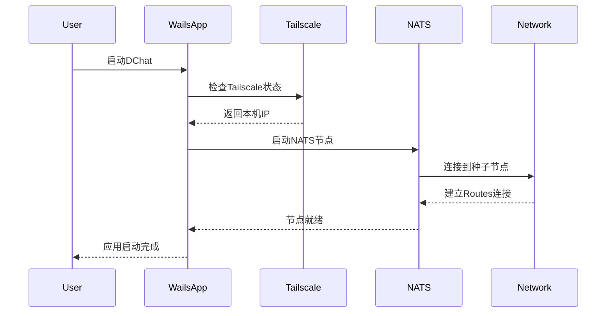

# 2025-08-06 重大重构
- 完善 internal/routes/routes.go，支持链式集群、动态节点加入、集群连通性检查、消息路由测试等功能，参考cmd/routes/main.go。
- 重构 internal/nats/service.go，仅保留NATS客户端功能，支持鉴权连接，去除服务端嵌入式启动。
- 新增 ClusterManager 类型，提供集群管理功能，支持节点创建、启动、停止、连通性检查。
- 完善 NATS 客户端，新增 JSON 序列化/反序列化、请求-响应模式、增强连接配置。
- 重构 config.go，分离 NATS 客户端配置和 Routes 集群配置，新增配置辅助方法。
- 创建 examples/cluster_demo.go 演示新设计的使用方法。
- **优化设计**：重命名 ClusterManager.network → clusterName，移除硬编码，新增 ClusterConfig 结构体支持可配置的主机地址和端口偏移量。
- **增强配置**：Routes 配置新增 Host 和 ClusterPortOffset 字段，支持更灵活的部署环境。
- **🔥 彻底清理硬编码**：
  - 移除所有硬编码的 IP 地址和端口
  - 移除向后兼容的旧 API，只保留最新设计
  - 新增 `GetLocalIP()` 自动检测本地 IP 地址
  - 新增 `ValidateAndSetDefaults()` 自动验证和设置配置默认值
  - 强制用户提供配置，避免隐式默认值
- **API 简化**：ClusterManager 现在要求明确的配置参数，增强了代码的可预测性和可维护性。

## 2025-08-08 记录：引入 NSC/JWT 凭据与首次初始化
- 客户端优先使用 NSC 生成的 .creds（JWT/公私钥）进行鉴权（internal/nats/service.go）。
- 配置新增字段：
  - nats.creds_file；routes.resolver_config；nsc 子配置（operator/store_dir/keys_dir/sys_jwt_path/sys_pub_path/sys_seed_path）。
- 新增 internal/nscsetup/setup.go：首次运行时通过 nsc 创建/初始化 operator(SYS)、生成 resolver.conf，写入 ~/.dchat；并把路径持久化到 ~/.dchat/config.json。
- 内置节点（internal/routes/routes.go）支持加载 resolver.conf，去除用户名/密码。
- demo/cluster 改为使用 creds 连接，并在启动前调用首启初始化。

实际执行步骤（zsh）：
```bash
# 构建（可选）
cd /home/orician/workspace/learn/nats/Dchat
go build ./...

# 运行 demo（首次会自动执行 nsc 初始化并生成 ~/.dchat/resolver.conf）
go run DecentralizedChat/demo/cluster/cluster_demo.go
```
备注：nsc 调用包含如下动作（由程序自动执行）：
- nsc add operator --generate-signing-key --sys --name local
- nsc edit operator --require-signing-keys --account-jwt-server-url nats://<host>:<port>
- nsc edit account SYS --sk generate
- nsc generate config --nats-resolver --sys-account SYS > ~/.dchat/resolver.conf

- 简化 SYS JWT 路径解析：移除多次回退 (JSON/文本) 解析逻辑，改为单次通过目录结构推导 `stores/<operator>/accounts/SYS/SYS.jwt`。
- 种子获取方式变更：不再遍历 keys 目录匹配公钥，改用 `nsc export keys --accounts --account SYS` 导出种子并写入本地配置目录。
- 清理: 移除未使用的 firstMatch 助手与 regexp 依赖（JWT 路径解析已无需正则）。
- 配置调整：NSC 配置改为存储用户级 (SYS/sys) 的 JWT/creds/seed（user_jwt_path/user_creds_path/user_seed_path, 增加 account/user 字段），不再持久化账户级 JWT。

## 2025-08-09 调整：停止记录 JWT 路径，仅保留 nkey (seed) 与 creds
- 移除 NSCConfig 中 user_jwt_path 与 account_jwt_path 字段及默认值。
- 删除 setup 初始化中对用户与账户 JWT 路径的收集与持久化逻辑，仅保留：
  - 用户级：user_creds_path, user_seed_path
  - 账户级：account_creds_path, account_seed_path
- 移除 findUserJWTPath / findAccountJWTPath 方法，避免不必要的磁盘路径依赖。
- 目的：运行期只需 creds（含 JWT + 签名身份）与必要的私钥 seed；JWT 原始文件路径不再需要持久化。

操作日志：
- 修改 internal/config/config.go 移除字段 user_jwt_path/account_jwt_path
- 修改 internal/nscsetup/setup.go 移除相关赋值与查找函数
- 更新 README 增加本节说明
 - 重构 internal/nscsetup/setup.go：引入 execCommand 统一 run 与 runOut 的公共逻辑，消除重复代码（DRY）。
 - 合并 seed 导出与 creds 查找：exportUserSeed/exportAccountSeed 合并为 exportSeed；findUserCredsFile/findAccountCredsFile 合并为 findCredsFile，减少重复。
```

## 运行演示
```bash
cd DecentralizedChat
go run examples/cluster_demo.go
```

## 新 API 特点
- 零硬编码：所有网络配置都通过参数传入
- 自动配置：自动检测本地 IP，自动生成 NATS URL
- 强类型：配置验证确保运行时安全
- 简洁API：移除冗余的向后兼容接口
# 去中心化聊天室 - DChat

## 项目概述

基于 **NATS Routes集群 + Tailscale + Wails** 构建的真正去中心化聊天室应用。

### 核心特性
- ⚡ **自动发现**：节点自动形成全网状网络，无需手动配置

## 技术架构

### 整体架构设计

```
用户设备A                用户设备B                用户设备C
│  (Routes)    │        │  (Routes)    │        │  (Routes)    │
│  Tailscale   │        │  Tailscale   │        │  Tailscale   │
│   Network    │        │   Network    │        │   Network    │
└──────────────┘        └──────────────┘        └──────────────┘
       │                        │                        │
       └────────────────────────┼────────────────────────┘
                                │
                     ┌──────────────┐
                     │  Tailscale   │
                     │   Mesh VPN   │
                     └──────────────┘
```

### 技术栈选择

#### 1. NATS Routes集群
- **用途**：实现真正去中心化的消息路由
- **优势**：
  - ✅ 支持链式连接（A→B→C自动发现）
  - ✅ 动态网络拓扑，无单点故障
  - ✅ 配置简单，只需种子节点地址
  - ✅ 自动形成全网状网络

#### 2. Tailscale网络
- **用途**：提供安全的P2P网络连接
- **优势**：
  - ✅ 零配置WireGuard VPN
  - ✅ 自动NAT穿透
  - ✅ 端到端加密
  - ✅ 跨平台支持
  - ✅ 网络自动发现

#### 3. Wails框架
- **用途**：构建现代化桌面应用
- **优势**：
  - ✅ Go后端 + React前端
  - ✅ 原生性能
  - ✅ 跨平台打包
  - ✅ 热重载开发
  - ✅ 系统集成能力

## 核心特性详解

### 1. 去中心化网络拓扑

基于NATS Routes的去中心化设计：

```
初始状态：NodeA (种子节点)
┌─────────┐
│ Node A  │
└─────────┘

添加NodeB：A←→B
┌─────────┐    ┌─────────┐
│ Node A  │◄──►│ Node B  │
└─────────┘    └─────────┘

添加NodeC：A←→B←→C，A自动发现C
┌─────────┐    ┌─────────┐    ┌─────────┐
│ Node A  │◄──►│ Node B  │◄──►│ Node C  │
└─────────┘    └─────────┘    └─────────┘
      ▲                              │
      └──────────────────────────────┘
              自动建立连接

最终形成全网状网络：每个节点都与其他节点连接
```

**关键特性：**
- 🎯 **链式连接**：新节点只需连接任一现有节点
- 🎯 **自动发现**：Routes协议自动建立全连通网络
- 🎯 **动态自愈**：节点故障时自动从网络移除
- 🎯 **无中心节点**：所有节点地位平等

### 2. Tailscale安全网络

解决公网连接和安全问题：

```
传统方案（FRP）的问题：
❌ 需要公网服务器
❌ 端口映射复杂
❌ 安全性依赖配置
❌ 单点故障风险

Tailscale方案优势：
✅ P2P直连，无需中转
✅ 自动NAT穿透
✅ WireGuard加密
✅ 零配置安全
```

**Tailscale集成方式：**
- 每个用户设备加入Tailscale网络
- NATS节点通过Tailscale IP互连
- 自动获得加密和认证
- 支持动态IP变化

### 3. Wails应用架构

现代化桌面应用设计：

```
┌─────────────────────────────────────┐
│             前端 (React)            │
│         React.js + JSX             │
├─────────────────────────────────────┤
│             Wails Bridge            │
├─────────────────────────────────────┤
│              后端 (Go)              │
│  ├─ NATS客户端                      │
│  ├─ Tailscale集成                   │
│  ├─ 消息加密/解密                    │
│  ├─ 用户管理                        │
│  └─ 系统集成                        │
└─────────────────────────────────────┘
```

## 实现方案

### 配置示例

#### 1. NATS Routes配置

**基础节点配置：**
```conf
# nats-node.conf
# 客户端连接端口
port: 4222
server_name: "dchat-node-{user_id}"

# Routes集群配置
cluster: {
  name: "dchat_network"
  # 集群端口
  port: 6222
  # 连接到种子节点（Tailscale IP）
  routes: [
    "nats://100.64.1.100:6222"  # 种子节点的Tailscale IP
  ]
}

# 账户和权限配置
include "accounts.conf"
```

**启动脚本：**
```bash
#!/bin/bash
# start-dchat-node.sh

# 获取本机Tailscale IP
TAILSCALE_IP=$(tailscale ip -4)

# 启动NATS服务器
nats-server \
  -p 4222 \
  -cluster "nats://${TAILSCALE_IP}:6222" \
  -routes "nats://seed-node-tailscale-ip:6222" \
  -server_name "dchat-${USER}-$(hostname)"
```

#### 2. Tailscale集成

**自动Tailscale配置：**
```go
// internal/network/tailscale.go
package network

import (
    "context"
    "tailscale.com/client/tailscale"
)

type TailscaleManager struct {
    client *tailscale.Client
}

func (tm *TailscaleManager) GetLocalIP() (string, error) {
    status, err := tm.client.Status(context.Background())
    if err != nil {
        return "", err
    }
    return status.Self.TailscaleIPs[0].String(), nil
}

func (tm *TailscaleManager) GetPeerIPs() ([]string, error) {
    status, err := tm.client.Status(context.Background())
    if err != nil {
        return nil, err
    }
    
    var ips []string
    for _, peer := range status.Peer {
        if len(peer.TailscaleIPs) > 0 {
            ips = append(ips, peer.TailscaleIPs[0].String())
        }
    }
    return ips, nil
}
```

#### 3. Wails应用结构

**项目结构：**
```
dchat/
├── app.go                 # Wails应用入口
├── build/                 # 构建输出
├── frontend/              # 前端代码
│   ├── dist/
│   ├── index.html
│   ├── src/
│   │   ├── main.jsx       # React入口文件
│   │   ├── App.jsx        # 主应用组件
│   │   ├── components/    # React组件
│   │   │   ├── ChatRoom.jsx
│   │   │   ├── Sidebar.jsx
│   │   │   └── UserList.jsx
│   │   └── styles/        # CSS样式
│   │       ├── App.css
│   │       └── components/
│   ├── package.json       # Node.js依赖
│   └── vite.config.js     # Vite配置
├── wailsjs/               # Wails生成的JS绑定
│   ├── go/
│   └── runtime/
├── internal/              # 内部包
│   ├── nats/             # NATS客户端
│   ├── network/          # Tailscale集成
│   ├── crypto/           # 消息加密
│   ├── chat/             # 聊天逻辑
│   └── config/           # 配置管理
├── wails.json            # Wails配置
└── main.go               # 程序入口
```

**主应用代码：**

### 启动流程

#### 1. 应用启动序列



#### 2. 节点发现流程

```bash
# 第一个用户启动（种子节点）
User A: 启动DChat → 成为种子节点（100.64.1.100:6222）

# 第二个用户加入
User B: 启动DChat → 连接到种子节点 → 形成A←→B网络

# 第三个用户加入
User C: 启动DChat → 连接到B节点 → Routes自动发现A
结果：形成A←→B←→C全连通网络

# 后续用户加入
User D: 连接到任意现有节点 → 自动加入全网状网络
```

#### 3. 消息路由示例

```go
// 用户A发送消息到聊天室"general"
UserA.SendMessage("general", "Hello everyone!")

// NATS Routes自动路由到所有节点
// 所有订阅"chat.general"主题的用户都会收到消息
```

## 高级功能

### 1. 消息加密

### 2. 用户身份管理

### 3. 聊天室管理

### 4. 前端界面设计

**React.js聊天界面：**

## 部署和使用

### 1. 环境准备

**安装依赖：**
```bash
# 安装Tailscale
curl -fsSL https://tailscale.com/install.sh | sh
sudo tailscale up

# 安装NATS Server
go install github.com/nats-io/nats-server/v2@latest

# 安装Wails
go install github.com/wailsapp/wails/v2/cmd/wails@latest
```

### 2. 构建应用

```bash
# 克隆项目
git clone https://github.com/your-org/dchat.git
cd dchat

# 安装前端依赖
cd frontend
pnpm install
cd ..

# 构建开发版本（支持热重载）
wails dev

# 构建生产版本
wails build
```

### 3. 首次使用

```bash
# 1. 确保Tailscale已连接
tailscale status

# 2. 启动DChat应用
./build/bin/dchat

# 3. 应用自动：
#    - 检测Tailscale网络
#    - 启动NATS节点
#    - 连接到现有网络或创建新网络
#    - 开始聊天！
```

### 4. 网络拓扑示例

**小型团队（3-5人）：**
```
Alice (种子) ←→ Bob ←→ Charlie
     ↑                    ↓
     └──────── Diana ←────┘
```

**大型社区（10+人）：**
```
     Alice ←→ Bob ←→ Charlie
       ↑        ↑        ↓
    Diana ←→ Eve ←→ Frank ←→ Grace
       ↑        ↑        ↓
     Henry ←→ Ivan ←→ Jack
```

**全连通网络**：每个节点都能直接通信，消息延迟最低。

## 开发路线图

### Phase 1: 核心功能 (已完成)
- ✅ NATS Routes集群研究和验证
- ✅ 链式连接原理验证
- ✅ 基础Demo实现

### Phase 2: Tailscale集成 (进行中)
- 🔄 Tailscale网络检测和集成
- 🔄 自动IP发现机制
- ⏳ 网络状态监控

### Phase 3: Wails应用开发 (计划中)
- ⏳ 项目结构搭建
- ⏳ Go后端服务架构
- ⏳ React.js前端界面
- ⏳ NATS客户端集成

### Phase 4: 聊天功能 (计划中)
- ⏳ 消息加密/解密
- ⏳ 用户身份管理
- ⏳ 聊天室管理
- ⏳ 文件传输支持

### Phase 5: 高级特性 (计划中)
- ⏳ 离线消息同步
- ⏳ 消息历史搜索
- ⏳ 群组权限管理
- ⏳ 插件系统

### Phase 6: 优化和发布 (计划中)
- ⏳ 性能优化
- ⏳ 跨平台测试
- ⏳ 打包和分发
- ⏳ 文档完善

## 技术优势总结

### 🎯 完全去中心化
- **无单点故障**：任意节点离线不影响网络
- **无固定服务器**：所有节点地位平等
- **自动网络发现**：新节点自动加入现有网络
- **动态自愈能力**：故障节点自动从网络移除

### 🔒 企业级安全
- **端到端加密**：Tailscale WireGuard加密
- **消息签名**：Ed25519数字签名验证身份
- **零信任架构**：不依赖中心化身份认证
- **网络隔离**：Tailscale提供网络层隔离

### ⚡ 极简配置
- **零配置网络**：Tailscale自动NAT穿透
- **一键启动**：Wails一键启动所有服务
- **自动发现**：NATS Routes自动建立连接
- **热插拔**：节点可随时加入/离开

### 🚀 现代化体验
- **原生性能**：Wails提供接近原生的性能
- **跨平台支持**：Windows/macOS/Linux统一体验
- **现代UI**：基于Web技术的灵活界面
- **实时通信**：NATS提供毫秒级消息延迟

## 参考资料

### 官方文档
- [NATS Routes官方文档](https://docs.nats.io/running-a-nats-service/configuration/clustering)
- [Tailscale官方文档](https://tailscale.com/kb/)
- [Wails框架文档](https://wails.io/docs/introduction)

### 技术研究
- [NATS Routes集群深度分析](./cmd/routes/routes.md)
- [TestChainedSolicitWorks源码分析](https://github.com/nats-io/nats-server/blob/main/test/route_discovery_test.go)

### 相关项目
- [nats-io/nats-server](https://github.com/nats-io/nats-server)
- [tailscale/tailscale](https://github.com/tailscale/tailscale)
- [wailsapp/wails](https://github.com/wailsapp/wails)

---

**项目愿景**：构建一个真正去中心化、安全、易用的现代聊天平台，让每个人都能拥有自己的通信网络。

**开始时间**：2025年8月3日  
**技术栈**：NATS Routes + Tailscale + Wails + Go + React.js  
**核心特性**：去中心化、链式连接、零配置、企业级安全

TODO:
1. route配置是否支持热重载? (不支持也无需)
2. 因为每个nats是消息队列,每个节点通过subject与集群通信,每个节点默认publish-subject: all-allow, subscribe subject: all-deny. ok
3.  客户端连接使用公私钥而不是帐号密码,使用nsc生成jwt token,通过公私钥加密通信 ok
4.  用户可以自行添加allow subscribe subject,会被写入到本地的config.json持久化, 本地配置文件存储信任的公钥路径列表 ok
5. tls加密连接,nsc自动生成凭证用于本地连接 ok
6. 完善React组件的TypeScript类型定义,添加React状态管理（Context或Redux）
7. 通过手动输入或tailscale cli自动查询ip,把tailscale内网IP和集群端口广播到特定主题
8.  要读取到tailscale的IP地址,需要在wails中调用tailscale命令行工具
9.  公私钥传输和解密每一条消息
10. 测试使用服务器公网ip节点,这样新节点不需要tailscale就能加入集群,但会导致中心化
11. 配置修改为wire依赖注入
12. 研究nsc key和jwt的关系和功能,探究去中心化鉴权
13. 节点的import配置能否热重启
14. 通过nsc支持帐号导出和导入,测试用户公私钥的获取
15. 群聊方案使用gateway集群,cluster群聊主题要deny-publish,去中心化认证用户
16. 读go代码和前端代码,计划修改方案

新增操作日志：
- 修改 internal/nscsetup/setup.go：移除单一 deriveAccountJWTPath 假设，新增 findAccountJWTPath 支持多种 nsc 存储结构并回退浅层遍历匹配 SYS.jwt。
- 重构 internal/nscsetup/setup.go：拆分 EnsureSysAccountSetup 为多个小函数（配置目录解析、NATS URL 生成、NSC 初始化、resolver.conf 生成、SYS 账户工件收集）。
- 简化 internal/nscsetup/setup.go 的 findAccountJWTPath，只保留单路径判断。
- 重写 internal/nscsetup/setup.go 的 findSeedByPublicKey，去除利用 errors.New("found") 作为控制流的反模式。
- 调整 internal/nscsetup/setup.go：collectSysAccountArtifacts 仅记录 findAccountCredsFile 返回的 SYS creds 路径，去除 sys.pub 写入。
15. 修正 SYS 账户 JWT 路径推断：支持当前 nsc 目录结构 (stores/<op>/accounts/SYS/SYS.jwt) 及旧布局 (account.jwt 与 hash 子目录)，新增 findAccountJWTPath 逻辑。
16. 重构 EnsureSysAccountSetup：抽取 resolveConfigDir/ensureNATSURL/initNSCOperatorAndSys/generateResolverConfig/collectSysAccountArtifacts，提升内聚与可读性。
17. 简化 findAccountJWTPath：仅保留当前实际结构 stores/<op>/accounts/SYS/SYS.jwt 解析逻辑，移除多余候选与遍历。
18. 重写 findSeedByPublicKey：移除通过返回 error 终止遍历的做法，改为正常遍历并在匹配后跳过后续处理逻辑，增强语义清晰度。
19. SYS 公钥路径改为优先记录 creds 文件路径 (keys/creds/<operator>/SYS/*.creds)，找不到再回退写 sys.pub。
20. 移除 sys.pub 回退逻辑：仅记录已有 creds 文件路径，不再生成 sys.pub。